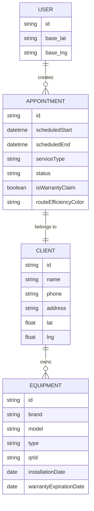
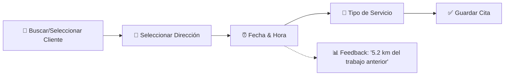

# 🗓️ MASTER PLAN: Agenda Inteligente HVAC

> **Versión Consolidada Final**  
> **Fecha:** 2024-12-24  
> **Estado:** REFERENCIA ÚNICA - Consolidación de v0.1.0 a v1.0.0

---

## 📋 Tabla de Contenidos

1. [Resumen Ejecutivo](#1-resumen-ejecutivo)
2. [Arquitectura del Sistema](#2-arquitectura-del-sistema)
3. [Funcionalidades Core](#3-funcionalidades-core)
4. [Modelo de Datos](#4-modelo-de-datos)
5. [Servicios Implementados](#5-servicios-implementados)
6. [UI/UX Specifications](#6-uiux-specifications)
7. [Decisiones Técnicas Finales](#7-decisiones-técnicas-finales)
8. [Estado de Implementación](#8-estado-de-implementación)
9. [Roadmap Pendiente](#9-roadmap-pendiente)

---

## 1. Resumen Ejecutivo

La **Agenda Inteligente HVAC** es un módulo central diseñado para optimizar el flujo de trabajo diario del técnico utilizando **"Inteligencia Costo-Efectiva"**. Combina vistas de calendario dinámicas, lógica de rutas offline-first, e integración profunda con el historial del cliente (Mini-CRM) y validación de garantías.

### Filosofía de Diseño
- **Offline-First:** Todas las funcionalidades críticas operan sin conexión
- **Costo $0:** Uso de Haversine (distancia lineal) vs API costosas
- **Thumb Zone UX:** Acciones principales en zona inferior de pantalla
- **PRO Features:** Validación de garantías como característica premium

---

## 2. Arquitectura del Sistema

### 2.1. Stack Tecnológico

| Componente | Tecnología | Estado |
|------------|------------|--------|
| Calendar UI | `react-native-big-calendar` (pendiente) | ⏳ Planificado |
| Gestures | `react-native-gesture-handler` | ✅ Disponible |
| Búsqueda | SQLite FTS5 (Full Text Search) | ⏳ Planificado |
| Maps/Nav | `expo-linking` (Waze/Google Maps) | ✅ Disponible |
| Offline DB | `expo-sqlite` / Firebase | ✅ Implementado |
| Routing | Haversine Formula | ✅ Implementado |

### 2.2. Diagrama de Entidades



---

## 3. Funcionalidades Core

### 3.1. Visualización Dinámica (Semantic Zoom)

| Vista | Descripción | Uso |
|-------|-------------|-----|
| **1 Día** | Desglose por hora, alta densidad de info | Modo Ejecución |
| **3 Días** | Ventana rodante de trabajo próximo | Vista Híbrida |
| **7 Días** | Bloques de color "Tetris" | Planificación |

**Interacción:** Pinch-to-zoom o botones toggle para cambiar nivel de detalle.

### 3.2. Flujo de Creación "Quick Add"



**Archivos Involucrados:**
- [wizard.tsx](file:///c:/TESIVIL/AWS-TESIVIL/AWS-TESIVIL/06_QRCLIMA/app/(app)/agenda/wizard.tsx) - Wizard de creación de citas

### 3.3. Optimización de Rutas (Haversine First)

- **Lógica:** Calcula "Distancia Lineal" desde la cita anterior o ubicación base del técnico
- **Offline:** Usa matemática pura (Fórmula Haversine), sin llamadas API
- **Disclaimer:** UI indica persistentemente "Distancias son estimados lineales"

**Estados de Eficiencia:**
| Color | Rango | Significado |
|-------|-------|-------------|
| 🟢 Verde | < 10 km | Óptimo |
| 🟡 Amarillo | 10-30 km | Aceptable |
| 🔴 Rojo | > 30 km | Ineficiente |

**Servicio Implementado:**
- [haversine-calculator.ts](file:///c:/TESIVIL/AWS-TESIVIL/AWS-TESIVIL/06_QRCLIMA/services/haversine-calculator.ts)

### 3.4. Smart Actions (Thumb Zone)

- **Ubicación:** Parte inferior de pantalla (Action Sheet / FAB)
- **Acciones:**
  - 🧭 "Navegar" (Waze/Google Maps)
  - 📞 "Llamar Cliente"
  - ▶️ "Iniciar Trabajo"
- **Interacción:** Tocar bloque de calendario abre Action Sheet con vista Mini-CRM

**Componente Implementado:**
- [ActionSheet.tsx](file:///c:/TESIVIL/AWS-TESIVIL/AWS-TESIVIL/06_QRCLIMA/components/agenda/ActionSheet.tsx)

### 3.5. Lógica de Garantía (PRO Feature)

| Tier | Capacidad |
|------|-----------|
| **FREE** | Solo etiqueta "Garantía" |
| **PRO** | Validación automática: `InstallationDate` + `WarrantyPeriod` vs Hoy |

**Flujo Crítico:** El input para definir período de garantía (ej: "1 Año") ocurre en el **Flujo de Cierre**, *antes* de la firma del cliente.

**Servicio Implementado:**
- [warranty-validator.ts](file:///c:/TESIVIL/AWS-TESIVIL/AWS-TESIVIL/06_QRCLIMA/services/warranty-validator.ts)

### 3.6. Búsqueda Global

- **UI:** Icono de lupa → Transición a List View
- **Filtros:** Nombre, Dirección, Teléfono, Número de Serie de Equipo
- **Performance:** < 100ms para 5,000+ registros (requiere FTS5)

---

## 4. Modelo de Datos

### 4.1. Campos de Usuario (Nuevos)

```typescript
// En user-service.ts o UserProfile
interface UserProfile {
  // ... campos existentes
  base_lat?: number;   // Latitud Base (Hogar/Oficina)
  base_lng?: number;   // Longitud Base
}
```

### 4.2. Campos de Equipo (Nuevos)

```typescript
interface Equipment {
  // ... campos existentes
  installationDate?: Date;
  warrantyExpirationDate?: Date;
  warrantyMonths?: number;
}
```

### 4.3. Campos de Servicio/Cita

```typescript
interface ServiceData {
  // ... campos existentes
  scheduledStart?: Date;
  scheduledEnd?: Date;
  isWarrantyClaim?: boolean;
  routeEfficiencyColor?: 'green' | 'yellow' | 'red';
  distanceFromPrevious?: number; // en km
}
```

---

## 5. Servicios Implementados

### 5.1. haversine-calculator.ts ✅

| Función | Descripción |
|---------|-------------|
| `getLinearDistance(start, end)` | Distancia en km entre dos puntos |
| `formatDistance(km)` | Formato amigable ("5.2 km" o "800 m") |
| `getRouteEfficiency(points[])` | Suma de distancias de una ruta |

### 5.2. warranty-validator.ts ✅

| Función | Descripción |
|---------|-------------|
| `checkWarrantyStatus(date, months)` | Retorna estado: active/expired/none |
| `validateWarrantyInput(months, isPro)` | Valida límites según tier |

### 5.3. clients-service.ts ✅

| Función | Descripción |
|---------|-------------|
| `addClient(data)` | Crear cliente |
| `getClients(technicianId)` | Listar clientes del técnico |
| `getClientById(id)` | Obtener cliente específico |
| `getClientServices(clientId, techId)` | Historial de servicios (Mini-CRM) |

### 5.4. services-service.ts ✅

| Función | Descripción |
|---------|-------------|
| `addService(data)` | Crear servicio/cita |
| `getUpcomingServices(techId)` | Citas pendientes futuras |
| `getRecentServices(techId, limit)` | Servicios recientes |

---

## 6. UI/UX Specifications

### 6.1. Legibilidad Solar

- **Contraste:** Colores de alto contraste (Negro sobre Blanco, Azul Oscuro sobre Blanco)
- **Colores de Servicio:** Distintos y vibrantes, evitar pasteles sutiles
- **Tipografía:** Fuentes grandes y bold para horas y nombres de clientes

### 6.2. Colores por Tipo de Servicio

| Tipo | Color | Hex |
|------|-------|-----|
| Mantenimiento | Azul | `#4A90D9` |
| Reparación | Rojo | `#D94A4A` |
| Instalación | Verde | `#4AD97E` |
| Garantía | Morado | `#9B59B6` |
| Cotización/Visita | Amarillo | `#F1C40F` |

### 6.3. Principios Thumb Zone

```
╔═══════════════════════════╗
║                           ║
║     Calendario/Lista      ║  ← Zona de Vista
║                           ║
║                           ║
╠═══════════════════════════╣
║  [🧭] [📞] [▶️ Iniciar]  ║  ← Thumb Zone (30% inferior)
╚═══════════════════════════╝
```

---

## 7. Decisiones Técnicas Finales

### Preguntas Resueltas

| Pregunta | Decisión |
|----------|----------|
| **¿Localización o Equipo primero?** | Localización primero (más rápido), equipo opcional |
| **¿Punto de partida de ruta?** | Ubicación Base configurable por técnico |
| **¿Cálculo de rutas API vs Haversine?** | Haversine para UI, API solo al navegar |
| **¿Conflictos de horario?** | Permitir overlap (Opción A) |
| **¿Modelo Appointment-Equipment?** | One-to-Many (1 cita = N equipos) |
| **¿Warning de garantía expirada?** | Mostrar warning pero permitir override |
| **¿Citas canceladas?** | Ignorar en cálculo de rutas |

### Constraints Críticos

1. **Offline:** Todas las operaciones de routing y búsqueda deben funcionar sin datos
2. **Performance:** Búsqueda debe ser < 100ms para 5,000+ registros
3. **Data Integrity:** Fechas de garantía inmutables después de firma

---

## 8. Estado de Implementación

### Archivos del Módulo Agenda

| Archivo | Descripción | Estado |
|---------|-------------|--------|
| [index.tsx](file:///c:/TESIVIL/AWS-TESIVIL/AWS-TESIVIL/06_QRCLIMA/app/(app)/agenda/index.tsx) | Vista principal del calendario | ✅ Básico |
| [wizard.tsx](file:///c:/TESIVIL/AWS-TESIVIL/AWS-TESIVIL/06_QRCLIMA/app/(app)/agenda/wizard.tsx) | Wizard de creación de citas | ✅ Funcional |

### Funciones Implementadas en Agenda

| Función | Ubicación | Estado |
|---------|-----------|--------|
| `loadEvents()` | index.tsx | ✅ |
| `getServiceColor(type)` | index.tsx | ✅ |
| `loadClients()` | wizard.tsx | ✅ |
| `handleClientSelect()` | wizard.tsx | ✅ |
| `handleDateChange()` | wizard.tsx | ✅ |
| `handleTimeChange()` | wizard.tsx | ✅ |

---

## 9. Roadmap Pendiente

### Fase 1: Database Upgrade 🔲
- [ ] Migración de schema para Base Location
- [ ] Campos geo-coords en clientes
- [ ] Campos de garantía en equipos

### Fase 2: Logic Core 🔲
- [ ] Integrar `HaversineCalculator` en wizard
- [ ] Integrar `WarrantyValidator` en flujo de cierre
- [ ] Implementar FTS5 para búsqueda

### Fase 3: UI Components 🔲
- [ ] Instalar `react-native-big-calendar`
- [ ] Implementar vistas 1/3/7 días
- [ ] Componente `DistanceIndicator` (pill verde/amarillo/rojo)
- [ ] Componente `MiniCRMCard` con historial

### Fase 4: Flows 🔲
- [ ] Refactorizar wizard con feedback de distancia en tiempo real
- [ ] Implementar Search List View con transición suave
- [ ] Inyectar paso de Garantía en Service Closing

### Fase 5: Polish 🔲
- [ ] Drag & Drop para reprogramar citas
- [ ] Notificaciones push/WhatsApp
- [ ] Testing offline completo
- [ ] Ajustes de UI para luz solar

---

## 📚 Historial de Versiones Consolidadas

Este documento consolida la evolución de:

| Versión | Enfoque Principal |
|---------|-------------------|
| v0.1.0 | Concepto inicial: Calendar views + Client First flow |
| v0.2.0 | Route Optimization + Thumb Zone UX |
| v0.3.0 | Haversine First (Cost-Effective) + Real-time feedback |
| v0.4.0 | Mini-CRM + Warranty Management |
| v1.0.0 | Consolidación final con PRO logic |

---

> **Este es el documento de referencia único.** Los archivos individuales de versión (v0.1.0 - v1.0.0) y OPEN_QUESTIONS se mantienen solo para referencia histórica.
