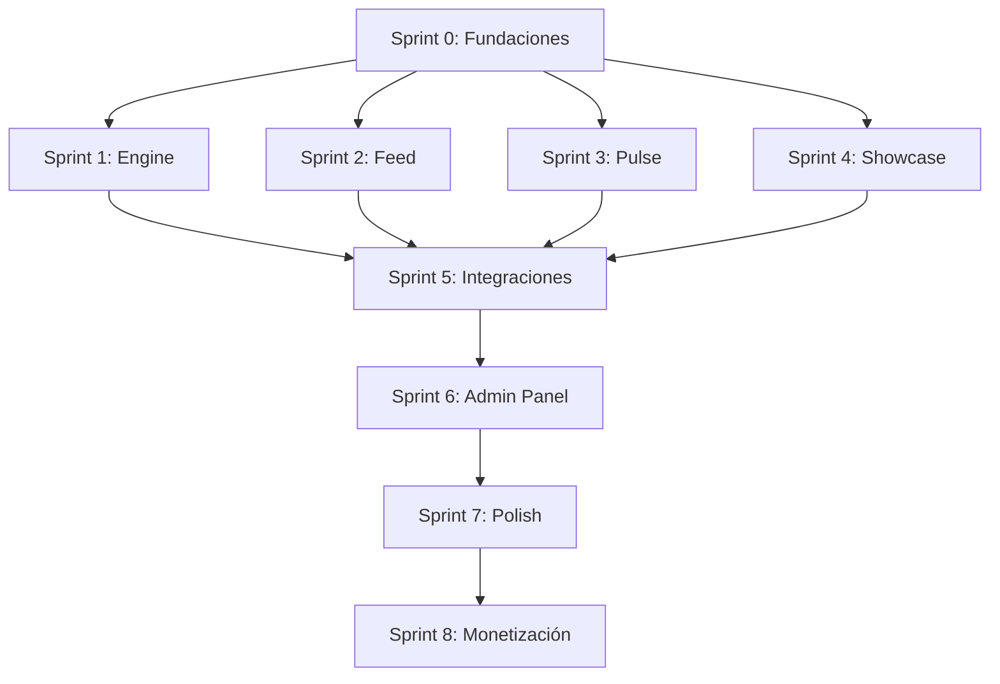

# SYNAPSE_AI — Plan de Implementación

> **Versión**: 1.0 | **Fecha**: 2025-12-19
> **Duración Estimada**: 8-10 semanas (desarrollo individual)
> **Prioridad**: Engine > Feed > Pulse > Showcase

---

## 📋 Resumen Ejecutivo

| Sprint | Nombre | Duración | Dependencias |
|--------|--------|----------|--------------|
| **0** | Fundaciones | 2 días | Ninguna |
| **1** | Engine MVP | 5 días | Sprint 0 |
| **2** | Feed MVP | 4 días | Sprint 0 |
| **3** | Pulse MVP | 5 días | Sprint 0 |
| **4** | Showcase MVP | 5 días | Sprint 0 |
| **5** | Integraciones | 3 días | Sprints 1-4 |
| **6** | Admin Panel | 4 días | Sprint 5 |
| **7** | Polish & Testing | 4 días | Sprint 6 |
| **8** | Monetización | 3 días | Sprint 7 |

**Total**: ~35 días de desarrollo activo

---

## 🔄 Diagrama de Dependencias


```mermaid
graph TD
    S0[Sprint 0: Fundaciones] --> S1[Sprint 1: Engine]
    S0 --> S2[Sprint 2: Feed]
    S0 --> S3[Sprint 3: Pulse]
    S0 --> S4[Sprint 4: Showcase]
    
    S1 --> S5[Sprint 5: Integraciones]
    S2 --> S5
    S3 --> S5
    S4 --> S5
    
    S5 --> S6[Sprint 6: Admin Panel]
    S6 --> S7[Sprint 7: Polish]
    S7 --> S8[Sprint 8: Monetización]
```

> **IMPORTANTE**: Los Sprints 1-4 son **paralelizables** si hay más de un desarrollador.
> Si es desarrollo individual, el orden recomendado es: Engine → Feed → Pulse → Showcase.

---

## 📦 Sprint 0: Fundaciones
**Duración**: 2 días | **Prioridad**: 🔴 Crítico

### Objetivo
Establecer la infraestructura base para que todos los módulos funcionen.

### Entregables

#### 0.1 Supabase Setup
```
[ ] Crear proyecto en app.supabase.com
[ ] Ejecutar migraciones SQL en orden:
    └── 001_profiles.sql
    └── 002_prompt_history.sql
    └── 003_ai_models.sql
    └── 004_news_articles.sql
    └── 005_projects.sql
    └── 006_analytics.sql
[ ] Verificar RLS policies activas
[ ] Configurar Storage bucket "project-images"
[ ] Obtener y guardar keys en .env
```

#### 0.2 API Backend
```
packages/api/
[ ] npm install
[ ] Crear src/routes/health.ts
[ ] Verificar npm run dev funciona
[ ] Probar endpoint GET /health
```

#### 0.3 App Móvil (Expo)
```
apps/mobile/
[ ] npx create-expo-app@latest . --template blank-typescript
[ ] npm install nativewind tailwindcss
[ ] npm install @supabase/supabase-js
[ ] npm install @tanstack/react-query
[ ] Configurar tailwind.config.js
[ ] Crear lib/supabase.ts
[ ] Crear app/_layout.tsx con QueryProvider
[ ] Verificar app se conecta a Supabase
```

#### 0.4 Configuración de API Keys
```
[ ] GROQ_API_KEY - https://console.groq.com
[ ] GEMINI_API_KEY - https://aistudio.google.com
[ ] Probar llamada básica a Groq desde API
[ ] Probar llamada básica a Gemini desde API
```

### ✓ Criterio de Done
- [ ] `npm run dev` funciona en raíz del monorepo
- [ ] App móvil muestra "Hello World" conectada a Supabase
- [ ] API responde en `localhost:3000/health`
- [ ] Llamadas a Groq y Gemini retornan respuesta

---

## 🎨 Sprint 1: Engine MVP
**Duración**: 5 días | **Prioridad**: 🔴 Crítico | **Dependencia**: Sprint 0

### Objetivo
Usuario puede generar un prompt de imagen profesional y copiarlo.

### Entregables

#### 1.1 Backend - Rutas API
```
packages/api/src/routes/prompts/
[ ] index.ts - Router principal
[ ] refine.ts - POST /api/prompts/refine (Capa A)
[ ] generate.ts - POST /api/prompts/generate (Capa B)
[ ] save.ts - POST /api/prompts/save
[ ] history.ts - GET /api/prompts/history
```

#### 1.2 Frontend - Componentes Base
```
apps/mobile/components/engine/
[ ] PromptWizard.tsx - Contenedor de 4 pasos
[ ] StepIndicator.tsx - Indicador 1/4, 2/4, etc.
[ ] StyleCard.tsx - Card de estilo con selección
[ ] ParamChip.tsx - Chip de parámetro seleccionable
[ ] ResultPanel.tsx - Panel con prompt final
[ ] HistoryList.tsx - Lista de últimos 5 prompts
```

#### 1.3 Frontend - Pantallas
```
apps/mobile/app/(tabs)/engine/
[ ] index.tsx - Pantalla principal Engine
[ ] _layout.tsx - Layout del módulo
```

#### 1.4 Assets
```
apps/mobile/assets/prompts/
[ ] Generar 8 imágenes de estilos (style_*.webp)
[ ] Generar 10 imágenes de parámetros (param_*.webp)
    └── Usar generate_image tool o Midjourney
```

#### 1.5 Lógica de Negocio
```
apps/mobile/hooks/
[ ] usePromptGenerator.ts - Mutación TanStack Query
[ ] usePromptHistory.ts - Query de historial
```

### Flujo a Implementar
```
[Input texto] → [8 tarjetas estilo] → [Params dinámicos] → [Resultado + Copiar]
      ↓                  ↓                    ↓                    ↓
   Varita            Selección            Ruta A/B            Toast + Save
   mágica            single               según estilo        en historial
```

### ✓ Criterio de Done
- [ ] Usuario puede escribir idea y presionar "Varita Mágica"
- [ ] Usuario puede seleccionar estilo (8 opciones)
- [ ] Parámetros cambian según ruta A (foto) o B (artístico)
- [ ] Prompt final se genera en < 2 segundos
- [ ] Botón "Copiar" funciona con Toast de confirmación
- [ ] Historial muestra últimos 5 prompts

---

## 📰 Sprint 2: Feed MVP
**Duración**: 4 días | **Prioridad**: 🟠 Alto | **Dependencia**: Sprint 0

### Objetivo
Usuario ve noticias resumidas por IA con actualizaciones automáticas.

### Entregables

#### 2.1 Backend - Pipeline de Noticias
```
packages/api/src/jobs/
[ ] news-aggregator.ts - Completo con RSS parser
[ ] Integrar processNewsArticle() de gemini.ts
[ ] Implementar lógica anti-duplicados 3 capas
```

#### 2.2 Backend - Rutas API
```
packages/api/src/routes/news/
[ ] index.ts - GET /api/news (feed paginado)
[ ] [id].ts - GET /api/news/:id (artículo)
[ ] comments.ts - POST /api/news/:id/comments
```

#### 2.3 Frontend - Componentes
```
apps/mobile/components/feed/
[ ] NewsCard.tsx - Tarjeta compacta en feed
[ ] NewsDetail.tsx - Bottom sheet con resumen
[ ] BulletList.tsx - 3 bullets estilizados
[ ] WhyItMatters.tsx - Sección "¿Por qué importa?"
[ ] CommentSection.tsx - Comentarios del artículo
```

#### 2.4 Frontend - Pantallas
```
apps/mobile/app/(tabs)/feed/
[ ] index.tsx - Feed principal con FlatList infinite
[ ] _layout.tsx - Layout del módulo
```

#### 2.5 Push Notifications (Básico)
```
[ ] Configurar expo-notifications
[ ] Trigger cuando importance >= 9
[ ] Deep link a artículo específico
```

### ✓ Criterio de Done
- [ ] Feed muestra noticias ordenadas por fecha
- [ ] Pull-to-refresh funciona
- [ ] Tap en noticia abre bottom sheet con resumen
- [ ] Cron job procesa RSS cada hora (en desarrollo)
- [ ] No hay duplicados en el feed

---

## 📊 Sprint 3: Pulse MVP
**Duración**: 5 días | **Prioridad**: 🟠 Alto | **Dependencia**: Sprint 0

### Objetivo
Usuario puede ver rankings de IA, comparar modelos y dejar reseñas.

### Entregables

#### 3.1 Backend - Sync Engine
```
packages/api/src/jobs/
[ ] sync-models.ts - Fetch OpenRouter + Groq refiner
[ ] sync-benchmarks.ts - Fetch LMSYS data
```

#### 3.2 Backend - Rutas API
```
packages/api/src/routes/models/
[ ] index.ts - GET /api/models (lista con filtros)
[ ] top.ts - GET /api/models/top (podio top 3)
[ ] [id].ts - GET /api/models/:id (ficha completa)
[ ] [id]/stats.ts - GET /api/models/:id/stats
[ ] [id]/reviews.ts - GET/POST reviews
[ ] compare.ts - GET /api/models/compare?a=X&b=Y
```

#### 3.3 Frontend - Componentes
```
apps/mobile/components/pulse/
[ ] Podium.tsx - Top 3 con medallas
[ ] ModelCard.tsx - Card en lista infinita
[ ] ModelDetail.tsx - Ficha completa
[ ] RadarChart.tsx - Gráfico spider-web
[ ] ReviewForm.tsx - 3 sliders + tag + comentario
[ ] ComparatorView.tsx - Vista lado a lado
[ ] TrendBadge.tsx - ↑↓ badge de tendencia
```

#### 3.4 Frontend - Pantallas
```
apps/mobile/app/(tabs)/pulse/
[ ] index.tsx - Home con podio + lista
[ ] [id].tsx - Detalle del modelo
[ ] compare.tsx - Comparador 2 modelos
[ ] _layout.tsx - Layout del módulo
```

#### 3.5 Seed Data
```
packages/db/seed/
[ ] initial_models.sql - 15 modelos iniciales con datos reales
```

### ✓ Criterio de Done
- [ ] Podio muestra top 3 modelos
- [ ] Lista infinita con filtros por categoría
- [ ] Ficha de modelo con radar chart
- [ ] Usuario puede dejar reseña
- [ ] Comparador funciona con 2 modelos
- [ ] Sync manual desde admin funciona

---

## 🚀 Sprint 4: Showcase MVP
**Duración**: 5 días | **Prioridad**: 🟡 Medio | **Dependencia**: Sprint 0

### Objetivo
Desarrolladores pueden publicar proyectos y la comunidad puede interactuar.

### Entregables

#### 4.1 Backend - Rutas API
```
packages/api/src/routes/projects/
[ ] index.ts - GET/POST /api/projects
[ ] [id].ts - GET /api/projects/:id
[ ] [id]/vote.ts - POST vote
[ ] [id]/view.ts - POST register view
[ ] [id]/comments.ts - GET/POST con moderación Groq
[ ] [id]/report.ts - POST report
```

#### 4.2 Frontend - Componentes
```
apps/mobile/components/showcase/
[ ] ProjectCard.tsx - Card para grid
[ ] ProjectDetail.tsx - Vista detallada
[ ] ProjectForm.tsx - Formulario de publicación
[ ] ImageCarousel.tsx - Carrusel de 3 imágenes
[ ] StackChips.tsx - Chips de herramientas
[ ] MetricsBar.tsx - Vistas, upvotes, comentarios
[ ] UploadImages.tsx - Picker + compresión WebP
```

#### 4.3 Frontend - Pantallas
```
apps/mobile/app/(tabs)/showcase/
[ ] index.tsx - Grid Masonry de proyectos
[ ] [id].tsx - Detalle del proyecto
[ ] new.tsx - Publicar nuevo proyecto
[ ] _layout.tsx - Layout del módulo
```

#### 4.4 Storage
```
[ ] Configurar Supabase Storage bucket
[ ] Implementar compresión WebP en cliente
[ ] Límite de 3 imágenes por proyecto
```

### ✓ Criterio de Done
- [ ] Usuario puede publicar proyecto con 3 imágenes
- [ ] Grid muestra proyectos con métricas
- [ ] Upvote funciona (1 por usuario)
- [ ] Comentarios pasan por moderación Groq
- [ ] Auto-hide cuando report_count >= 3

---

## 🔗 Sprint 5: Integraciones
**Duración**: 3 días | **Prioridad**: 🟡 Medio | **Dependencia**: Sprints 1-4

### Objetivo
Conectar módulos entre sí y pulir la navegación.

### Entregables

#### 5.1 Navegación Principal
```
apps/mobile/app/(tabs)/
[ ] _layout.tsx - Tab navigator con 4 tabs
[ ] Iconos para cada módulo
[ ] Animaciones de transición
```

#### 5.2 Cross-Module Links
```
[ ] Pulse → Engine: Botón "Crear Prompt" en ficha de modelo
[ ] Engine → History: Acceso a historial completo
[ ] Feed → Pulse: Link cuando noticia menciona modelo
[ ] Showcase → Pulse: Tags de herramientas linkeados
```

#### 5.3 Auth Flow
```
apps/mobile/app/(auth)/
[ ] login.tsx - Email/password + magic link
[ ] register.tsx - Registro con ToS checkbox
[ ] forgot.tsx - Recuperar contraseña
[ ] Implementar Supabase Auth
[ ] Proteger rutas que requieren login
```

#### 5.4 Profile
```
apps/mobile/app/(tabs)/profile/
[ ] index.tsx - Perfil del usuario
[ ] settings.tsx - Ajustes + Legal
[ ] my-projects.tsx - Mis proyectos (Showcase)
[ ] my-reviews.tsx - Mis reseñas (Pulse)
```

### ✓ Criterio de Done
- [ ] Navegación fluida entre 4 módulos
- [ ] Usuario puede registrarse y loguearse
- [ ] Links cross-module funcionan
- [ ] Perfil muestra datos del usuario

---

## 🖥️ Sprint 6: Admin Panel
**Duración**: 4 días | **Prioridad**: 🟡 Medio | **Dependencia**: Sprint 5

### Objetivo
Panel web para moderar contenido y ver métricas.

### Entregables

#### 6.1 Setup
```
apps/admin/
[ ] npm create vite@latest . -- --template react-ts
[ ] Configurar Tailwind + Shadcn/UI
[ ] Configurar Supabase client
[ ] Auth con role='admin' check
```

#### 6.2 Páginas
```
apps/admin/src/pages/
[ ] Dashboard.tsx - KPIs principales
[ ] Moderation.tsx - Cola de contenido reportado
[ ] News.tsx - Gestión de noticias
[ ] Models.tsx - Editar datos de modelos
[ ] Workflows.tsx - Editar system prompts
[ ] Analytics.tsx - Gráficos de uso
```

#### 6.3 Componentes
```
apps/admin/src/components/
[ ] Sidebar.tsx - Navegación lateral
[ ] StatsCard.tsx - Tarjeta de KPI
[ ] DataTable.tsx - Tabla con filtros
[ ] LineChart.tsx - Gráfico temporal
```

### ✓ Criterio de Done
- [ ] Admin puede ver dashboard con KPIs
- [ ] Admin puede moderar contenido reportado
- [ ] Admin puede editar modelos manualmente
- [ ] Admin puede enviar noticia manualmente

---

## ✨ Sprint 7: Polish & Testing
**Duración**: 4 días | **Prioridad**: 🟢 Normal | **Dependencia**: Sprint 6

### Objetivo
Refinar UX, manejar errores, y agregar tests básicos.

### Entregables

#### 7.1 UX Polish
```
[ ] Loading states con skeletons en todas las pantallas
[ ] Error states con retry buttons
[ ] Empty states con ilustraciones
[ ] Animaciones de micro-interacción
[ ] Haptic feedback en acciones importantes
```

#### 7.2 Error Handling
```
[ ] Toast de errores global
[ ] Retry automático con exponential backoff
[ ] Fallback cuando API falla
[ ] Offline detection con mensaje
```

#### 7.3 Testing Básico
```
packages/api/tests/
[ ] unit/services/groq.test.ts
[ ] unit/services/gemini.test.ts
[ ] integration/prompts.test.ts
[ ] integration/models.test.ts
```

#### 7.4 Performance
```
[ ] Lazy loading de imágenes
[ ] Memoización de componentes pesados
[ ] Optimistic updates en upvotes
[ ] Caché de TanStack Query optimizado
```

### ✓ Criterio de Done
- [ ] App no crashea en edge cases
- [ ] Todos los estados (loading/error/empty) implementados
- [ ] Tests unitarios pasan (≥80% coverage services)
- [ ] Performance aceptable en dispositivo real

---

## 💰 Sprint 8: Monetización
**Duración**: 3 días | **Prioridad**: 🟢 Normal | **Dependencia**: Sprint 7

### Objetivo
Preparar infraestructura de monetización (sin activar aún).

### Entregables

#### 8.1 AdMob Integration
```
[ ] Configurar react-native-google-mobile-ads
[ ] Crear AdWrapper component
[ ] Insertar ads en Feed (cada 5 noticias)
[ ] Insertar ads en Showcase (cada 6 proyectos)
[ ] Banner en Engine (pie de pantalla)
```

#### 8.2 Premium Flag
```
[ ] Implementar check is_premium en profile
[ ] Ocultar ads si premium
[ ] Gating de features premium:
    └── Engine: Varita mágica ilimitada
    └── Engine: 8 estilos (vs 4 free)
    └── History: 100 prompts (vs 5 free)
```

#### 8.3 Featured Projects (Stubs)
```
[ ] UI para proyectos destacados
[ ] Badge "Destacado ⭐" en cards
[ ] Lógica de expiración is_featured_until
```

#### 8.4 Analytics Tracking
```
[ ] Implementar trackEvent() helper
[ ] Tracking de todos los eventos definidos
[ ] Verificar datos llegan a app_analytics
```

### ✓ Criterio de Done
- [ ] Ads se muestran (modo test)
- [ ] Usuario premium no ve ads
- [ ] Analytics trackea eventos principales
- [ ] Featured projects se muestran arriba

---

## 📅 Cronograma Sugerido

```
Semana 1: Sprint 0 (2d) + Sprint 1 (5d)
Semana 2: Sprint 1 (cont) + Sprint 2 (4d)
Semana 3: Sprint 3 (5d)
Semana 4: Sprint 4 (5d)
Semana 5: Sprint 5 (3d) + Sprint 6 (4d)
Semana 6: Sprint 6 (cont) + Sprint 7 (4d)
Semana 7: Sprint 7 (cont) + Sprint 8 (3d)
Semana 8: Buffer para bugs + QA
```

---

## 🚨 Riesgos y Mitigaciones

| Riesgo | Probabilidad | Impacto | Mitigación |
|--------|--------------|---------|------------|
| API Groq rate limited | Media | Alto | Implementar queue + backoff |
| Gemini cambia API | Baja | Medio | Abstracción en gemini.ts |
| RSS feeds inconsistentes | Alta | Bajo | Fallback + logs de errores |
| Supabase free tier limitado | Media | Alto | Monitorear uso, upgrade si necesario |
| Expo build falla | Media | Medio | Build local como backup |

---

## ✅ Checklist Pre-Producción

Antes de publicar en stores:

```
[ ] Todas las API keys son de producción
[ ] RLS policies verificadas en Supabase
[ ] Cron jobs corriendo en servidor
[ ] Admin panel desplegado
[ ] Legal docs accesibles (ToS, Privacy)
[ ] Disclaimer de IA visible
[ ] Tests E2E pasan
[ ] Performance en dispositivo real OK
[ ] App icon y splash screen
[ ] Screenshots para stores
```

---

## 📚 Recursos Útiles

- [Expo Docs](https://docs.expo.dev)
- [Supabase Docs](https://supabase.com/docs)
- [Groq API](https://console.groq.com/docs)
- [Gemini API](https://ai.google.dev/docs)
- [NativeWind](https://www.nativewind.dev)
- [TanStack Query](https://tanstack.com/query)

---

*Plan de Implementación SYNAPSE_AI v1.0*
*Generado: 2025-12-19*
