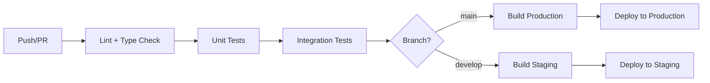

# 09_SYNAPSE_AI – Plan Maestro Unificado

> **Versión**: 2.1 | **Fecha**: 2025-12-18
> **Estado**: En Desarrollo (Ejecución)

---

## 1. Visión y Concepto
**Ecosistema "Todo en Uno" de IA**: Una navaja suiza móvil para profesionales y creadores que buscan dominar la Inteligencia Artificial sin fricción. Actúa como un centro de mando central para mantenerse actualizado, seleccionar herramientas y construir proyectos impulsados por IA.

**Diferenciadores Clave**:
- **Velocidad Extrema**: Impulsado por la arquitectura de baja latencia de Groq.
- **Mantenimiento Cero**: Automatización basada en Cron para noticias y rankings; sin mantenimiento manual de datos.
- **Utilidad Primero**: Enfoque en herramientas accionables en lugar de conversación genérica.

---

## 2. Los 4 Pilares del Producto

| Pilar | Nombre | Descripción | Tecnología Core |
|-------|--------|-------------|-----------------|
| 🎨 | **Engine (Prompts)** | Constructor visual de prompts técnicos (imágenes, workflows) con refinamiento "mágico". | Groq (Llama 3.3 70B) |
| 📊 | **The Pulse (Rankings)** | Monitor en tiempo real: benchmarks técnicos vs sentimiento comunitario. | OpenRouter + LMSYS |
| 📰 | **Feed (News)** | Noticias sintetiadas automáticamente, sin ruido y anti-duplicados. | Gemini 2.0 Flash |
| 🚀 | **Showcase (Community)** | Galería para que desarrolladores presuman proyectos y reciban feedback. | Groq + WebP Compression |

---

## 3. Arquitectura Técnica

### Stack Tecnológico
- **Frontend Móvil**: React Native + Expo + NativeWind (Tailwind CSS).
  - *Razón*: Iteración rápida, soporte nativo de notificaciones y diseño profesional.
  - **Estado**: TanStack Query (para manejo eficiente de caché y datos offline).
- **Backend API**: Node.js (TypeScript) + Fastify + PM2.
  - *Razón*: Alto rendimiento y streaming de respuestas IA.
- **Base de Datos**: Supabase (PostgreSQL).
  - *Razón*: Relacional, Auth integrado, Realtime y Storage para activos.
- **Admin Panel (Web)**: React + Vite + Tailwind + Shadcn/UI.
  - *Razón*: Gestión de contenido, moderación y análisis de métricas.
- **Microservicios IA**:
  - **Lógica Rápida**: Groq Cloud (Llama 3.3) para prompts y moderación (<500ms).
  - **Procesamiento Masivo**: Google Gemini 2.0 Flash para resúmenes de noticias y deduplicación.
  - **Datos de Mercado**: OpenRouter API para sincronización de modelos.
- **Infraestructura**:
  - **Servidor**: VPS (AWS/GCP) con Docker para aislar servicios.
  - **Proxy**: Nginx.
  - **CDN**: CloudFront/Cloud CDN para assets estáticos e imágenes WebP.

---

## 4. Estructura de Base de Datos (Schema)

### Usuarios y Perfiles
```sql
create table profiles (
  id uuid primary key references auth.users,
  email text,
  alias text unique,
  photo_url text,
  is_premium boolean default false,
  role text check (role in ('user', 'developer', 'partner')),
  created_at timestamptz default now()
);
```

### Módulo 1: Prompt Engine
```sql
create table prompt_builder_history (
  id uuid primary key default uuid_generate_v4(),
  user_id uuid references profiles(id),
  input_raw text,       -- Idea original
  input_enriched text,  -- Enriquecido por Groq "Capa A"
  config_json jsonb,    -- { style: 'anime', lens: 'macro', aspect: '16:9' }
  prompt_final text,    -- Resultado final para copiar
  created_at timestamptz default now()
);
```

### Módulo 2: The Pulse (Rankings)
```sql
create table ai_models (
  id text primary key,  -- ej. 'anthropic/claude-3.5-sonnet'
  name text,
  brand text,
  version text,
  logo_url text,
  pricing_input_1m decimal,
  pricing_output_1m decimal,
  context_window int,
  category text,        -- 'Pro' | 'Flash'
  is_active boolean default true,
  updated_at timestamptz default now()
);

-- Índice para filtrado por marca
create index idx_ai_models_brand on ai_models(brand);

create table ai_benchmarks (
  id uuid primary key default uuid_generate_v4(),
  model_id text references ai_models(id),
  source text,          -- 'LMSYS', 'HumanEval'
  metric_name text,     -- 'Coding', 'Math', 'Hard Prompts'
  score decimal,
  updated_at timestamptz default now()
);

create table ai_reviews (
  id uuid primary key default uuid_generate_v4(),
  model_id text references ai_models(id),
  user_id uuid references profiles(id),
  stars_speed int check (stars_speed between 1 and 5),
  stars_precision int check (stars_precision between 1 and 5),
  stars_hallucination int check (stars_hallucination between 1 and 5), -- 5 = No alucina
  comment text,
  use_case_tag text,    -- '#Coding', '#Creative', '#Analysis'
  is_helpful_count int default 0,
  created_at timestamptz default now()
);

-- Sistema de votos para reseñas
create table ai_votes (
  id uuid primary key default uuid_generate_v4(),
  review_id uuid references ai_reviews(id) on delete cascade,
  user_id uuid references profiles(id),
  vote_type text check (vote_type in ('upvote', 'downvote')),
  created_at timestamptz default now(),
  unique(review_id, user_id)
);

-- Índices para consultas frecuentes
create index idx_ai_reviews_model on ai_reviews(model_id);
create index idx_ai_reviews_user on ai_reviews(user_id);
```

### Módulo 3: News Feed
```sql
create table news_articles (
  id uuid primary key default uuid_generate_v4(),
  topic_id text,        -- Hash semántico para deduplicar
  title text,
  summary_json jsonb,   -- { bullets: [], why_it_matters: "" }
  source_name text,
  url_original text unique,
  image_url text,
  importance_score int check (importance_score between 1 and 10),
  created_at timestamptz default now()
);

-- Comentarios en noticias
create table news_comments (
  id uuid primary key default uuid_generate_v4(),
  article_id uuid references news_articles(id) on delete cascade,
  user_id uuid references profiles(id),
  comment_text text not null,
  created_at timestamptz default now()
);

-- Índice para feed cronológico y por importancia
create index idx_news_articles_created on news_articles(created_at desc);
create index idx_news_articles_importance on news_articles(importance_score desc);
```

### Módulo 4: Showcase
```sql
create table projects (
  id uuid primary key default uuid_generate_v4(),
  user_id uuid references profiles(id),
  title text not null,
  description text,
  stack_tags text[],    -- ['React', 'Groq', 'Supabase']
  project_url text,
  action_type text check (action_type in ('visit', 'download', 'showcase')) default 'showcase',
  image_urls text[],    -- Array de URLs (WebP), máximo 3
  views_count int default 0,
  upvotes_count int default 0,
  report_count int default 0,
  is_hidden boolean default false,
  is_featured_until timestamptz, -- Para monetización
  created_at timestamptz default now()
);

-- Comentarios en proyectos (moderados por Groq)
create table project_comments (
  id uuid primary key default uuid_generate_v4(),
  project_id uuid references projects(id) on delete cascade,
  user_id uuid references profiles(id),
  comment_text text not null,
  sentiment text check (sentiment in ('question', 'praise', 'neutral')),
  is_moderated boolean default false,
  created_at timestamptz default now()
);

-- Votos para proyectos (evitar duplicados)
create table project_votes (
  id uuid primary key default uuid_generate_v4(),
  project_id uuid references projects(id) on delete cascade,
  user_id uuid references profiles(id),
  created_at timestamptz default now(),
  unique(project_id, user_id)
);

-- Índices para galería y moderación
create index idx_projects_user on projects(user_id);
create index idx_projects_featured on projects(is_featured_until desc nulls last);
create index idx_projects_created on projects(created_at desc);
```

---

## 5. Diseño UX/UI y Flujos

### Design System
- **Estilo**: "Dark Mode Premium". Negro profundo (#0a0a0a), Grises (#1f1f1f), Acentos Eléctricos (Azul #3B82F6, Púrpura #8B5CF6).
- **Glassmorphism**: Paneles semi-transparentes (blur 16px, opacidad 0.1) para separar contexto.
- **Tipografía**: Inter (UI), JetBrains Mono (código). Escala: 12-14-16-20-24px.
- **Espaciado**: Sistema de 4px (4, 8, 12, 16, 24, 32, 48).
- **Radios**: 8px (chips), 12px (cards), 16px (modals).

### Componentes Reutilizables
| Componente | Descripción |
|------------|-------------|
| **Cards** | Tarjetas con imagen, título, badges y acciones |
| **Chips/Tags** | Filtros horizontales scrollables |
| **Radar Chart** | Visualización spider-web para benchmarks |
| **Bottom Sheet** | Detalle expandible desde la base |
| **Toast** | Feedback inmediato ("¡Copiado!", "¡Guardado!") |
| **Empty State** | Ilustración + CTA cuando no hay datos |

### Estados Críticos de UX
| Estado | Implementación |
|--------|----------------|
| **Loading** | Skeleton shimmer en cards |
| **Error** | Mensaje amigable + botón retry |
| **Empty** | Ilustración + texto motivacional + CTA |
| **Success** | Micro-animación de pulso en elementos actualizados |

### Flujos Principales

#### Módulo 1: Generador de Prompts
1.  **Input**: Usuario escribe idea básica ("Un gato cyberpunk").
2.  **Estilo**: Selecciona 1 de 8 tarjetas visuales (Fotorealismo, 3D, Anime, etc.).
3.  **Refinamiento**: Groq expande la idea + aplica parámetros técnicos (Lente, Iluminación).
4.  **Salida**: Prompt listo para copiar + historial reciente.

#### Módulo 2: The Pulse (Rankings)
1.  **Home**: Podio Top 3 + Lista filtrable (Código, Chat, Gratis).
2.  **Comparador**: Selección de 2 modelos -> Tabla "Versus" (Precio, Velocidad, Benchmark).
3.  **Reseña**: Formulario rápido con 3 sliders (Velocidad, Precisión, Realidad) + Tags.

#### Módulo 3: News Feed
1.  **Feed**: Scroll infinito de tarjetas compactas.
2.  **Lectura**: Al tocar, bottom-sheet con "Resumen en 3 puntos" y "¿Por qué me importa?".
3.  **Push**: Notificación inteligente solo para noticias de impacto > 8/10.

#### Módulo 4: Showcase
1.  **Grid**: Muros de proyectos (Masonry layout).
2.  **Detalle**: Carrusel de imágenes + Stack tecnológico + Botón "Probar".
3.  **Interacción**: Upvote y Comentarios (moderados por Groq).

---

## 6. Automatización y Mantenimiento ("Zero-Maintenance")

| Tarea Cron | Frecuencia | Propósito | Tecnología |
|---|---|---|---|
| **Sync Models** | Semanal | Actualizar lista de modelos y precios desde OpenRouter. | Node.js + OpenRouter API |
| **Sync Benchmarks** | Mensual | Importar scores técnicos desde LMSYS/HuggingFace. | Node.js + Python Script |
| **News Scraper** | Cada hora | Buscar noticias RSS, resumir y deduplicar. | Node.js + Gemini Flash |
| **Push Alerts** | Trigger | Enviar notificación cuando `importance_score > 8`. | Firebase Cloud Messaging |
| **Cleanup** | Diario | Borrar logs antiguos y archivos temporales. | Postgres Function |

### Lógica Anti-Duplicados (News)
1. **Capa 1**: Verificar `url_original` único en Supabase (constraint UNIQUE).
2. **Capa 2**: Gemini genera `topic_id` semántico basado en contenido.
3. **Capa 3**: Descartar si existe `topic_id` en últimas 24 horas.

### Analytics & Métricas
```sql
-- Tracking de eventos para análisis
create table app_analytics (
  id uuid primary key default uuid_generate_v4(),
  event_type text,      -- 'click_ai_link', 'prompt_generated', 'project_viewed'
  target_id text,
  user_id uuid references profiles(id),
  metadata jsonb,       -- { platform, version, source }
  created_at timestamptz default now()
);

-- Tracking de clics para afiliados y monetización
create table clicks (
  id uuid primary key default uuid_generate_v4(),
  user_id uuid references profiles(id),
  target_url text not null,
  click_count int default 1,
  last_clicked_at timestamptz default now()
);

create index idx_analytics_event on app_analytics(event_type, created_at desc);
create index idx_clicks_user on clicks(user_id);
```

---

## 7. Estrategia de Monetización

### Fase 1: MVP — Ads Nativos No Intrusivos

| Ubicación | Formato | Integración UX |
|-----------|---------|----------------|
| **Feed Noticias** | Card Publicitaria | 1 ad cada 5-7 noticias (etiqueta "Patrocinado") |
| **Showcase** | Proyecto Destacado | 1 slot entre proyectos comunidad |
| **Generador Prompts** | Banner Minimalista | Banner al pie (no bloquea copiar) |

### Fase 2: Puestos Destacados + Afiliados

#### Featured Projects (Showcase)
- **Precio**: $5-$10 por 24-48h en Top 3
- **Columna**: `is_featured_until` (timestamptz)
- **Badge**: Etiqueta sutil "Destacado" ⭐

#### Programa de Afiliados (Rankings)
- **Lógica**: Links con parámetros de afiliado en botón "Probar"
- **Comisión**: Si usuario se suscribe → % para SYNAPSE
- **Alternativa**: Vender botón "Probar" a herramientas emergentes

### Fase 3: Biblioteca Premium

#### Prompts Maestros (Engine)
| Tipo | Precio | Ejemplo |
|------|--------|---------|
| Micro-pago | $0.99 one-time | "Diseño planos eléctricos" |
| Pack Pro | $4.99 | 10 prompts especializados |
| Suscripción | $2.99/mes | Todos los estilos exclusivos |

### Fase 4: B2B Insights (Madurez)

Datos valiosos para empresas de IA:
- ¿Qué modelos prefiere la comunidad?
- ¿Cuáles reportan alucinaciones?
- ¿Qué stacks de programación se usan?

**Producto**: Reportes mensuales de tendencias para:
- Desarrolladores de modelos
- Agencias de marketing tech

---

## 7.1 Arquitectura para Escalabilidad

### Sistema de Roles
```sql
alter table profiles add column role text default 'user'
  check (role in ('user', 'developer', 'partner', 'admin'));
```

| Rol | Permisos |
|-----|----------|
| `user` | Uso normal, ve ads |
| `developer` | Puede subir a Showcase |
| `partner` | Afiliado, comisiones |
| `admin` | Panel de administración |

### Tracking de Clics (Para vender ads)
```sql
create table clicks (
  id uuid primary key default uuid_generate_v4(),
  user_id uuid references profiles(id),
  target_type text not null,    -- 'model', 'news', 'project'
  target_id text not null,
  destination_url text,
  created_at timestamptz default now()
);

create index idx_clicks_target on clicks(target_type, created_at);
```

**Uso**: "Mi app generó 500 clics hacia herramientas de código esta semana"

### Preparación para Pagos
```
/services/
└── billing/
    ├── stripe.ts       // Futuro
    ├── revenuecat.ts   // In-app purchases
    └── webhooks.ts     // Success/Error handlers
```

### Flag Premium
```sql
alter table profiles add column is_premium boolean default false;
alter table profiles add column premium_until timestamptz;
```

### Renderizado Condicional
```typescript
function AdWrapper({ children }) {
  const { user } = useAuth();
  if (user?.is_premium) return null;
  return <AdMobComponent />;
}
```

---

## 7.2 Panel de Administración Web (Backoffice)

### Tecnología
- **Stack**: React + Vite + Tailwind + Shadcn/UI
- **Auth**: Supabase Auth (rol `admin` requerido)
- **Conexión**: Misma DB de Supabase que la app móvil

### Módulos del Panel

| Módulo | Función |
|--------|---------|
| **📊 Dashboard** | KPIs en tiempo real, gráficos de retención |
| **🛡️ Moderador** | Cola de contenido flaggeado por Groq para revisión manual |
| **📰 Gestor Noticias** | Ver noticias del cron, push manual de breaking news |
| **🤖 Configurador IAs** | Editar datos de modelos si el sync falló |
| **⚙️ Editor Workflows** | Actualizar system prompts sin tocar código |
| **💰 Monetización** | Featured projects, suscripciones activas |

### KPIs Críticos

| Categoría | Métricas |
|-----------|----------|
| **Usuarios** | DAU, WAU, Retención 7d, Conversión free→premium |
| **Contenido** | Proyectos con más clics, Noticias más comentadas |
| **Calidad** | IAs con más downvotes (detectar degradación) |
| **Monetización** | Impresiones ads, CTR, Suscripciones activas |
| **Operaciones** | Latencia Groq/Gemini, Consumo tokens/día |

### Tabla de Analítica
```sql
create table app_analytics (
  id uuid primary key default uuid_generate_v4(),
  event_type text not null,     -- 'click_ai', 'prompt_generated', 'project_viewed'
  target_id text,               -- ID del modelo, noticia o proyecto
  user_id uuid references profiles(id),
  metadata jsonb,               -- { "platform": "android", "version": "1.0" }
  created_at timestamptz default now()
);

create index idx_analytics_event on app_analytics(event_type, created_at);
create index idx_analytics_user on app_analytics(user_id);
```

### Eventos a Trackear

| Evento | Cuándo |
|--------|--------|
| `prompt_generated` | Usuario genera prompt |
| `model_viewed` | Abre ficha de IA |
| `model_clicked` | Click en "Probar" (link externo) |
| `news_viewed` | Abre noticia |
| `project_viewed` | Abre proyecto Showcase |
| `project_clicked` | Click en "Visitar/Descargar" |
| `ad_impression` | Se muestra un ad |
| `ad_clicked` | Usuario toca ad |

---

## 7.3 Evolución: AI Business Architect (Premium)

### Concepto
Workflow completo para crear planes de proyecto con IA.

### Flujo
```
[1. Definición] → [2. Plan Maestro] → [3. Prompts por Etapa]

Usuario describe     Groq genera MVP,     Botones para cada fase:
idea de negocio      stack, fases         "Generar DB Schema"
                                          "Generar Copy Marketing"
```

### Monetización
| Tier | Acceso |
|------|--------|
| Free | Ver resumen del plan |
| Premium | Descargar PDF completo + prompts de ejecución |

### Tabla Workflows
```sql
create table workflows (
  id uuid primary key default uuid_generate_v4(),
  user_id uuid references profiles(id),
  title text not null,
  description text,
  plan_json jsonb,              -- { mvp, stack[], phases[] }
  is_complete boolean default false,
  created_at timestamptz default now()
);

create table workflow_prompts (
  id uuid primary key default uuid_generate_v4(),
  workflow_id uuid references workflows(id) on delete cascade,
  phase text,                   -- 'database', 'marketing', 'frontend'
  prompt_content text,
  created_at timestamptz default now()
);
```

---

## 8. Roadmap de Implementación

| Fase | Tiempo Est. | Entregables Clave |
|---|---|---|
| **0. Fundaciones** | Q1 2026 | Setup Repo, Configuración Supabase, Integración Groq Hello-World. |
| **1. Engine + Feed** | Q2 2026 | UI Generador de Prompts, Pipeline de Noticias Automático. |
| **2. The Pulse** | Q3 2026 | Sistema de Rankings, Base de datos de Benchmarks, Votación. |
| **3. Showcase** | Q4 2026 | Carga de Proyectos, Moderación IA, Galería Pública. |
| **4. Monetización** | H1 2027 | Pasarela de Pagos, Ads, Sistema Premium. |

---

## 9. Legal y Cumplimiento

### Documentos Requeridos (Accesibles desde Ajustes)
1.  **Términos y Condiciones (ToS)**: "El usuario asume el riesgo del uso de IA".
2.  **Aviso de Privacidad**: Transparencia sobre datos (Emails, Votos). Cumplimiento GDPR-like con derechos ARCO.
3.  **Disclaimer de IA**: "La IA puede alucinar. No usar para decisiones médicas/legales".
4.  **Take-Down Policy**: Procedimiento para remoción de contenido UGC reportado en Showcase.

### Acciones de UI
- Checkbox de aceptación obligatorio en Registro (links a ToS y Privacy).
- Aviso "Generado por IA" al pie de cada prompt o resumen.
- Botón de "Reportar Contenido" en Showcase.
- Acceso permanente a documentos legales desde Perfil → Ajustes → Legal.

---

## 10. Seguridad: Row Level Security (RLS)

### Políticas por Tabla

#### profiles
```sql
-- Los usuarios solo pueden ver/editar su propio perfil
alter table profiles enable row level security;

create policy "Users can view own profile"
  on profiles for select
  using (auth.uid() = id);

create policy "Users can update own profile"
  on profiles for update
  using (auth.uid() = id);
```

#### prompt_builder_history
```sql
-- Los usuarios solo ven su propio historial
alter table prompt_builder_history enable row level security;

create policy "Users can view own prompts"
  on prompt_builder_history for select
  using (auth.uid() = user_id);

create policy "Users can insert own prompts"
  on prompt_builder_history for insert
  with check (auth.uid() = user_id);

create policy "Users can delete own prompts"
  on prompt_builder_history for delete
  using (auth.uid() = user_id);
```

#### ai_reviews / ai_votes
```sql
-- Las reseñas son públicas para lectura, privadas para escritura
alter table ai_reviews enable row level security;

create policy "Anyone can view reviews"
  on ai_reviews for select
  using (true);

create policy "Authenticated users can create reviews"
  on ai_reviews for insert
  with check (auth.uid() = user_id);

create policy "Users can edit own reviews"
  on ai_reviews for update
  using (auth.uid() = user_id);

-- Votos: un voto por usuario por reseña
alter table ai_votes enable row level security;

create policy "Anyone can view votes"
  on ai_votes for select
  using (true);

create policy "Authenticated users can vote"
  on ai_votes for insert
  with check (auth.uid() = user_id);

create policy "Users can change own vote"
  on ai_votes for update
  using (auth.uid() = user_id);
```

#### projects / project_comments
```sql
-- Proyectos públicos (no ocultos) visibles para todos
alter table projects enable row level security;

create policy "View public projects"
  on projects for select
  using (is_hidden = false OR auth.uid() = user_id);

create policy "Users can create projects"
  on projects for insert
  with check (auth.uid() = user_id);

create policy "Users can edit own projects"
  on projects for update
  using (auth.uid() = user_id);

-- Comentarios moderados públicos
alter table project_comments enable row level security;

create policy "View moderated comments"
  on project_comments for select
  using (is_moderated = true OR auth.uid() = user_id);

create policy "Authenticated users can comment"
  on project_comments for insert
  with check (auth.uid() = user_id);
```

#### news_articles (solo lectura pública)
```sql
alter table news_articles enable row level security;

create policy "Anyone can read news"
  on news_articles for select
  using (true);

-- Solo service role puede insertar (cron jobs)
create policy "Service role inserts news"
  on news_articles for insert
  with check (auth.role() = 'service_role');
```

---

## 11. Estrategia de Caché (TanStack Query)

### Configuración Global
```typescript
const queryClient = new QueryClient({
  defaultOptions: {
    queries: {
      staleTime: 5 * 60 * 1000,      // 5 minutos por defecto
      gcTime: 30 * 60 * 1000,        // 30 minutos en caché
      retry: 2,
      refetchOnWindowFocus: false,
      refetchOnReconnect: true,
    },
  },
});
```

### Stale Times por Módulo

| Módulo | Query Key | Stale Time | Justificación |
|--------|-----------|------------|---------------|
| **News Feed** | `['news', 'feed']` | 15 min | Noticias se actualizan cada hora |
| **AI Rankings** | `['models', 'ranking']` | 1 hora | Datos semanales, poco volátiles |
| **AI Benchmarks** | `['models', id, 'benchmarks']` | 24 horas | Datos mensuales |
| **User Reviews** | `['models', id, 'reviews']` | 5 min | Contenido UGC frecuente |
| **Showcase Feed** | `['projects', 'feed']` | 5 min | UGC activo |
| **Prompt History** | `['prompts', 'history']` | 0 (siempre fresco) | Datos personales críticos |
| **User Profile** | `['profile', userId]` | 10 min | Cambios poco frecuentes |

### Invalidación de Caché

```typescript
// Después de crear una reseña
queryClient.invalidateQueries({ queryKey: ['models', modelId, 'reviews'] });

// Después de votar un proyecto
queryClient.invalidateQueries({ queryKey: ['projects', projectId] });

// Después de crear un prompt
queryClient.invalidateQueries({ queryKey: ['prompts', 'history'] });
```

### Datos Offline (Persistencia)

```typescript
import { createSyncStoragePersister } from '@tanstack/query-sync-storage-persister';
import AsyncStorage from '@react-native-async-storage/async-storage';

const persister = createSyncStoragePersister({
  storage: AsyncStorage,
  key: 'SYNAPSE_CACHE',
});

// Datos que se cachean offline:
// - ai_models (catálogo completo)
// - news_articles (últimas 50)
// - prompt_builder_history del usuario
```

---

## 12. Plan de Testing

### Estructura de Tests

```
tests/
├── unit/
│   ├── services/
│   │   ├── prompt-service.test.ts
│   │   ├── ranking-service.test.ts
│   │   └── news-service.test.ts
│   └── utils/
│       ├── formatters.test.ts
│       └── validators.test.ts
├── integration/
│   ├── api/
│   │   ├── groq-integration.test.ts
│   │   ├── gemini-integration.test.ts
│   │   └── openrouter-integration.test.ts
│   └── db/
│       ├── rls-policies.test.ts
│       └── triggers.test.ts
└── e2e/
    ├── prompt-flow.test.ts
    ├── review-flow.test.ts
    └── showcase-flow.test.ts
```

### Cobertura Mínima

| Tipo | Cobertura Target | Herramienta |
|------|------------------|-------------|
| **Unit** | ≥80% | Jest + Testing Library |
| **Integration** | ≥60% | Supertest + Supabase Test Helpers |
| **E2E** | Flujos críticos | Detox (mobile) / Playwright (web) |

### Tests Críticos por Módulo

#### Prompt Engine
- ✅ Input sanitization
- ✅ Groq API response handling
- ✅ Config JSON validation
- ✅ Rate limiting respetado

#### The Pulse (Rankings)
- ✅ Score calculation accuracy
- ✅ Vote uniqueness constraint
- ✅ Model sync from OpenRouter

#### News Feed
- ✅ Deduplication logic (3 capas)
- ✅ Importance score assignment
- ✅ Push notification trigger

#### Showcase
- ✅ Image upload + WebP conversion
- ✅ Content moderation flow
- ✅ Report count → auto-hide

### Comandos de Test

```bash
# Unit tests
npm run test:unit

# Integration tests (requiere .env.test)
npm run test:integration

# E2E tests (requiere emulador/simulador)
npm run test:e2e

# Cobertura completa
npm run test:coverage
```

---

## 13. Pipeline CI/CD

### Flujo de Trabajo



### GitHub Actions Workflow

```yaml
# .github/workflows/ci.yml
name: CI/CD Pipeline

on:
  push:
    branches: [main, develop]
  pull_request:
    branches: [main]

jobs:
  lint-and-test:
    runs-on: ubuntu-latest
    steps:
      - uses: actions/checkout@v4
      
      - name: Setup Node.js
        uses: actions/setup-node@v4
        with:
          node-version: '20'
          cache: 'npm'
      
      - name: Install dependencies
        run: npm ci
      
      - name: Lint
        run: npm run lint
      
      - name: Type Check
        run: npm run type-check
      
      - name: Unit Tests
        run: npm run test:unit -- --coverage
      
      - name: Integration Tests
        run: npm run test:integration
        env:
          SUPABASE_URL: ${{ secrets.SUPABASE_URL }}
          SUPABASE_ANON_KEY: ${{ secrets.SUPABASE_ANON_KEY }}
          GROQ_API_KEY: ${{ secrets.GROQ_API_KEY }}

  build-mobile:
    needs: lint-and-test
    runs-on: ubuntu-latest
    if: github.ref == 'refs/heads/main'
    steps:
      - uses: actions/checkout@v4
      
      - name: Setup Expo
        uses: expo/expo-github-action@v8
        with:
          expo-version: latest
          eas-version: latest
          token: ${{ secrets.EXPO_TOKEN }}
      
      - name: Build Android
        run: eas build --platform android --non-interactive
      
      - name: Build iOS
        run: eas build --platform ios --non-interactive

  deploy-backend:
    needs: lint-and-test
    runs-on: ubuntu-latest
    if: github.ref == 'refs/heads/main'
    steps:
      - uses: actions/checkout@v4
      
      - name: Deploy to VPS
        uses: appleboy/ssh-action@v1
        with:
          host: ${{ secrets.VPS_HOST }}
          username: ${{ secrets.VPS_USER }}
          key: ${{ secrets.VPS_SSH_KEY }}
          script: |
            cd /app/synapse-api
            git pull origin main
            npm ci --production
            pm2 reload synapse-api
```

### Entornos

| Entorno | Branch | URL | Propósito |
|---------|--------|-----|-----------|
| **Development** | feature/* | localhost | Desarrollo local |
| **Staging** | develop | staging.synapse.app | QA y pruebas |
| **Production** | main | synapse.app | Usuarios finales |

### Secrets Requeridos

```
# GitHub Secrets
SUPABASE_URL
SUPABASE_ANON_KEY
SUPABASE_SERVICE_ROLE_KEY
GROQ_API_KEY
GEMINI_API_KEY
OPENROUTER_API_KEY
EXPO_TOKEN
VPS_HOST
VPS_USER
VPS_SSH_KEY
```

---

*Documento Maestro Unificado – Fuente de Verdad para Desarrollo.*
*Última actualización: 2025-12-18*

