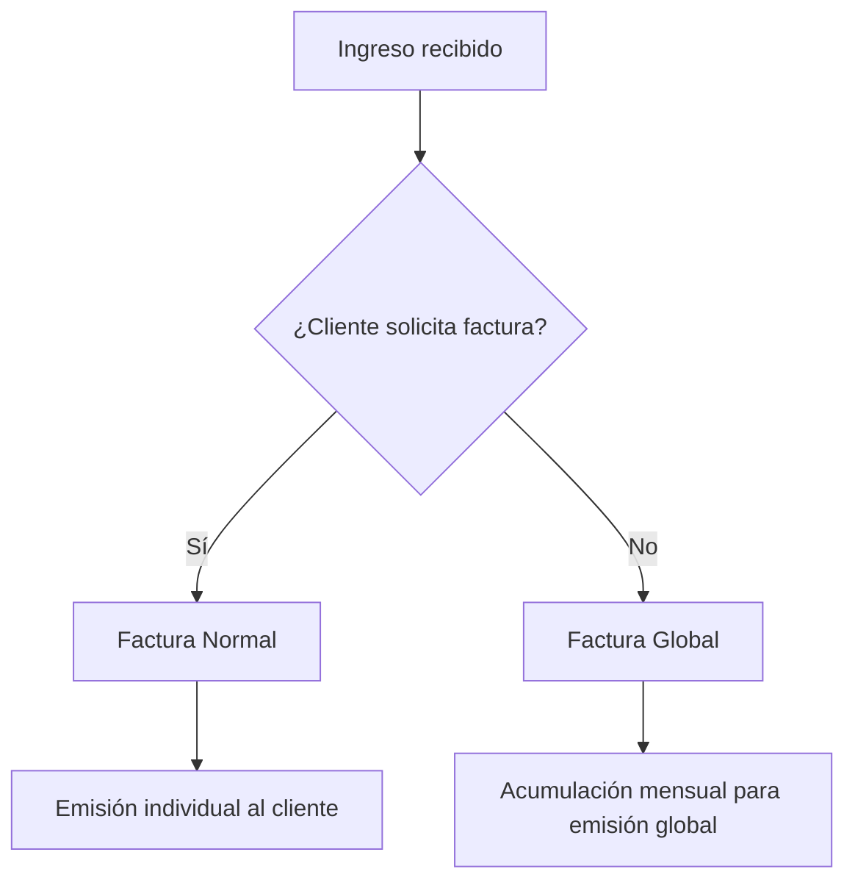
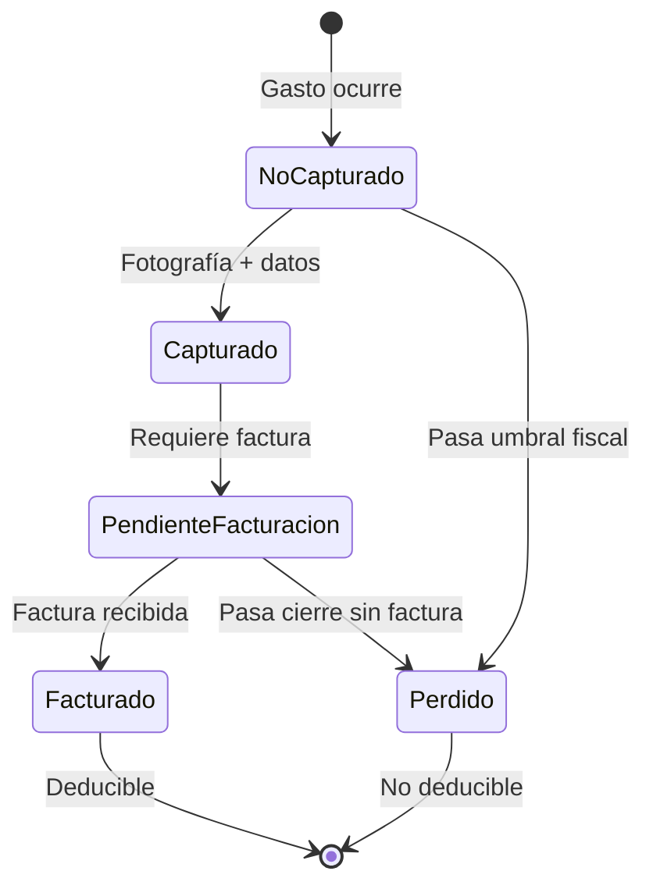
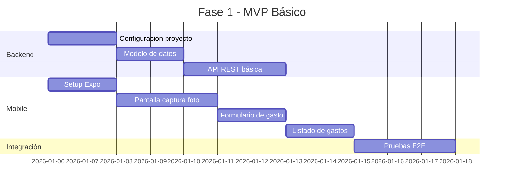

# 📈 MASTER PLAN - TICKET TRACKER

---

## Control de Cambios

| Versión | Fecha       | Descripción                                    |
|---------|-------------|------------------------------------------------|
| 1.17    | 2026-01-03  | Integración de Decisiones Estratégicas CAME    |
| 1.16    | 2026-01-03  | Selección Tecnológica y Arquitectura Base (Preliminar) |
| 1.15    | 2026-01-03  | Integración del Contexto Técnico del Usuario   |
| 1.14    | 2026-01-03  | Cierre Iteración 6 reglas negocio (usuario)    |
| 1.13    | 2026-01-03  | Inicio Iteración 6 reglas negocio (12-B)       |
| 1.12    | 2026-01-03  | Cierre Iteración 5 entidades/estados (11-B)    |
| 1.11    | 2026-01-03  | Inicio Iteración 5 entidades/estados (10-B)    |
| 1.10    | 2026-01-03  | Cierre Iteración 4 flujos información (09-B)   |
| 1.9     | 2026-01-03  | Inicio Iteración 4 flujos información (08-B)   |
| 1.8     | 2026-01-03  | Cierre Iteración 3 alcance funcional (07-B)    |
| 1.7     | 2026-01-03  | Inicio Iteración 3 alcance funcional (06-B)    |
| 1.6     | 2026-01-03  | Actores, ruptura y cierre Iteración 2 (05-B)   |
| 1.5     | 2026-01-03  | Validación del dolor e inicio Iteración 2 (04-B) |
| 1.4     | 2026-01-03  | Definición formal del dolor principal (03-B)   |
| 1.3     | 2026-01-02  | Agregado módulo de efectivo y cajas chicas     |
| 1.2     | 2026-01-02  | Agregados módulos de ingresos y conciliación   |
| 1.1     | 2026-01-02  | Agregados recordatorios y foco en facturación  |
| 1.0     | 2026-01-02  | Creación inicial del plan maestro de proyecto  |

---

## 👤 Contexto Técnico del Usuario

> [!NOTE]
> Esta sección documenta el **CONTEXTO** del usuario desarrollador. La información aquí contenida es de referencia para decisiones técnicas futuras. **No constituye requerimientos ni decisiones tomadas.**

### Perfil del Usuario Desarrollador

| Aspecto | Valor | Descripción |
|---------|-------|-------------|
| **Nivel técnico** | Intermedio | Conocimientos de programación no expertos pero funcionales |
| **Rol en el desarrollo** | Orquestador de IA | El usuario dirige el desarrollo mediante herramientas de IA, no programa directamente |
| **Experiencia en el dominio** | Avanzado | Conocimiento profundo del problema fiscal y operativo a resolver |

### Recursos Técnicos Disponibles

| Recurso | Disponibilidad | Detalle |
|---------|----------------|---------|
| **Máquina virtual** | Sí | AWS Ubuntu (disponible para despliegue) |
| **Tipo de servicios** | Gratuitos | Solo se utilizarán servicios sin costo |
| **Presupuesto** | $0 MXN | Sin inversión monetaria disponible |
| **Infraestructura local** | PC Windows | 8 GB RAM (recurso limitado para desarrollo) |

### Implicaciones para el MVP

> [!IMPORTANT]
> Esta información es **contexto**, no decisiones. Las siguientes implicaciones son **observaciones** para considerar en fases posteriores:

| Área | Observación Contextual |
|------|------------------------|
| **Stack tecnológico** | El contexto sugiere preferencia por herramientas que funcionen bien con asistentes de IA y tengan tier gratuito |
| **Complejidad de código** | El rol de orquestador sugiere preferencia por soluciones de menor complejidad en mantenimiento |
| **Despliegue** | VM AWS Ubuntu disponible como opción de hosting |
| **Desarrollo local** | Restricción de 8 GB RAM a considerar para herramientas de desarrollo |
| **Servicios cloud** | Priorizar servicios con tier gratuito generoso |

---

## 🎯 Visión del Proyecto

> **Crear una herramienta interna de control financiero previo al cierre fiscal que gestione gastos, ingresos y efectivo con trazabilidad completa, garantizando cero omisiones en facturación y facilitando la conciliación para facturas globales.**

> [!IMPORTANT]
> **4 Ejes Conceptuales**: Gastos (tickets), Ingresos (depósitos), Conciliación (facturas globales) y Efectivo (cajas chicas).

> [!WARNING]
> **Flujo Crítico**: El efectivo es un flujo opaco que requiere control específico mediante cajas chicas con trazabilidad y responsabilidad por persona.

---

## 🔴 Definición del Dolor Principal

> [!TIP]
> **Estado**: ✅ Definición del dolor **VALIDADA y CONGELADA** como insumo del Plan Maestro. Iteración 1 formalmente cerrada.

### Manifestación del Problema

El problema se manifiesta **mensualmente** y se acumula de forma progresiva hasta volverse **crítico en el cierre anual (fiscal)**.

### Consecuencias Primarias Identificadas

| # | Consecuencia | Impacto |
|---|--------------|---------|
| 1 | **Pérdida económica** | No deducir gastos a tiempo y desbalance fiscal durante el año |
| 2 | **Estrés operativo** | Carga de trabajo concentrada en cierre con riesgo de errores |
| 3 | **Riesgo fiscal inaceptable** | Exposición a sanciones por inconsistencias fiscales |

### Umbral de Inaceptabilidad

> **Cualquier gasto o factura que quede registrado fuera de su mes correspondiente es INACEPTABLE.**

Este umbral define el punto crítico donde el problema deja de ser tolerable y requiere intervención inmediata.

### Rol del Eje Efectivo

> [!NOTE]
> El eje **Efectivo** no es el dolor raíz del problema, pero actúa como un **amplificador crítico** que magnifica las consecuencias cuando no existe trazabilidad adecuada del flujo de caja.

---

## 🧭 Iteración 2: Actores, Responsabilidades y Puntos de Ruptura

> [!TIP]
> **Estado**: ✅ Iteración 2 **CERRADA**. No se avanzará a definición de alcance funcional hasta confirmación explícita del usuario.

### Objetivo de la Iteración

Identificar **actores reales**, **responsabilidades** y **puntos de ruptura operativa** del proceso actual.

### Actores Reales Consolidados

| Actor | Rol | Descripción |
|-------|-----|-------------|
| **Representante Legal** | Dueño del dolor | Responsable fiscal último. Quien carga las consecuencias del descontrol. |
| **Socio** | Coadyuvante operativo-moral | Apoyo en la gestión operativa y supervisión. |
| **Operadores del desorden** | Generadores de información | Todas las personas que manejan dinero (empleados, colaboradores). |
| **Clientes** | Fuente de ingresos | Generan ingresos que deben ser registrados y conciliados. |

### Preguntas Socráticas Resueltas

| # | Pregunta | Respuesta |
|---|----------|-----------|
| 1 | ¿Quién carga el dolor? | El **Representante Legal**, como responsable fiscal. |
| 2 | ¿Quién genera el desorden durante el año? | Los **operadores del desorden** (personas que manejan dinero) y los **clientes** (que generan ingresos). |
| 3 | ¿En qué punto exacto se pierde el control? | Cuando **la información no se captura y se pierde**, haciendo irrecuperables tickets y datos fiscales. |

### Diagnóstico del Problema

> [!IMPORTANT]
> El problema es **sistémico**, no de mala intención. No se trata de negligencia individual sino de falta de herramientas y procesos adecuados para captura y preservación de información fiscal.

### Pilares Justificados del Sistema

A partir del diagnóstico, se justifican dos pilares fundamentales para el MVP:

| Pilar | Justificación |
|-------|---------------|
| **Captura Simplificada** | Si el punto de ruptura es "no capturar", la solución debe hacer la captura tan simple que sea inevitable. |
| **Repositorio Confiable** | Si el problema es "se pierde", debe existir un lugar seguro donde la información nunca se pierda. |

> [!NOTE]
> **📌 Anotación de Contexto Técnico**: El pilar de "Captura Simplificada" se alinea con el perfil de orquestador de IA del usuario, sugiriendo priorizar UX intuitiva sobre funcionalidades complejas. El "Repositorio Confiable" deberá considerar servicios cloud con tier gratuito dada la restricción presupuestal de $0 MXN.

### Criterio para Evaluación de Fase 2

> [!NOTE]
> La **responsabilidad por persona** (asignar manejo de efectivo a individuos específicos) queda como criterio preliminar para evaluar en **Fase 2**, una vez validado el MVP básico.

---

## 🎯 Iteración 3: Alcance Funcional del MVP

> [!TIP]
> **Estado**: ✅ Iteración 3 **CERRADA**. No se avanzará a definición de flujos de información hasta confirmación explícita del usuario.

> [!TIP]
> **Iteraciones 1, 2 y 3**: ✅ Aprobadas y validadas. Contenido congelado como parte del Plan Maestro.

### Objetivo de la Iteración

Definir el **alcance funcional del MVP** del Ticket Tracker, estableciendo límites claros para evitar scope creep.

### Preguntas Socráticas Resueltas

| # | Pregunta | Respuesta |
|---|----------|-----------|
| 1 | ¿Cuál es el resultado mínimo aceptable tras un mes de uso? | **Ningún gasto del mes quede sin facturar** + **Visibilidad exacta del monto a facturar** (facturas globales y normales). |
| 2 | ¿Qué actividades actuales pueden eliminarse o simplificarse? | **Cruces manuales de información** y **reconstrucción de ingresos**. |
| 3 | ¿Cuál es el límite duro que no debe cruzar el MVP? | **Exclusión de integraciones automáticas** con SAT y bancos, así como **automatizaciones complejas**. |

### Resultado Mínimo Aceptable (Criterio de Éxito del MVP)

> [!IMPORTANT]
> Tras un mes de uso del sistema, el resultado mínimo aceptable es:
> 1. **Ningún gasto del mes quede sin facturar**
> 2. **Visibilidad exacta del monto a facturar** en facturas globales y normales

### Actividades a Eliminar/Simplificar

| Actividad Actual | Acción en MVP |
|------------------|---------------|
| Cruces manuales de información | **Eliminar** - El sistema consolidará automáticamente |
| Reconstrucción de ingresos | **Eliminar** - Los ingresos se capturarán en tiempo real |

### Límites Duros del MVP (No Cruzar)

> [!WARNING]
> Los siguientes elementos quedan **explícitamente excluidos** del MVP para evitar retrasos o fracaso:

| Exclusión | Justificación |
|-----------|---------------|
| Integraciones automáticas con SAT | Complejidad regulatoria y técnica alta |
| Integraciones automáticas con bancos | Requiere APIs bancarias y certificaciones |
| Automatizaciones complejas | Riesgo de scope creep y retrasos |

> [!NOTE]
> **📌 Anotación de Contexto Técnico**: Las exclusiones se refuerzan por el nivel técnico intermedio del usuario y el rol de orquestador de IA. Integraciones SAT y bancarias requerirían conocimientos especializados y posiblemente costos de certificación ($0 MXN presupuesto).

### Resumen de Alcance MVP

> [!NOTE]
> **[CAME]** El alcance del MVP fue definido en las Decisiones Estratégicas CAME. Ver sección "Decisiones Estratégicas Integradas".

| Categoría | Elementos |
|-----------|-----------|
| ✅ **Entra en MVP** | Captura de tickets, registro de gastos, estados de facturación, listados, búsqueda, recordatorios básicos, ingresos, conciliación básica, **OCR con alcance controlado** [CAME D4, D5] |
| ❌ **No entra en MVP** | Integraciones SAT/bancos, automatizaciones complejas, multi-usuario [CAME D8], recordatorios nivel 4 [CAME D7] |
| ⏳ **Se posterga** | Responsabilidad por persona (Fase 2), reportes avanzados, exportación, integración contable, recordatorios avanzados [CAME D7] |

---

## 🔄 Iteración 4: Flujos de Información Administrativos

> [!TIP]
> **Estado**: ✅ Iteración 4 **CERRADA**. Se avanzará a la definición de Entidades y Estados del Sistema tras confirmación explícita del usuario.

> [!TIP]
> **Iteraciones 1, 2, 3 y 4**: ✅ Aprobadas y validadas. Contenido congelado como parte del Plan Maestro.

### Objetivo de la Iteración

Definir los **flujos de información administrativos** sin entrar en tecnología ni UX:
- ¿Dónde nace la información?
- ¿Quién la captura?
- ¿Cuándo se vuelve fiscalmente relevante?
- ¿Dónde se pierde?

### Preguntas Socráticas Resueltas

| # | Pregunta | Respuesta |
|---|----------|-----------|
| 1 | ¿En qué momento exacto "nace" un gasto? | Al **recibir el ticket**. Debe capturarse de inmediato. |
| 2 | ¿Cuál es el punto de no retorno fiscal? | **2 días antes del cierre de mes**. Después de este umbral, la información no capturada se vuelve irrecuperable fiscalmente. |
| 3 | ¿Cuál es el proceso real para decidir la facturación de ingresos? | La decisión debe tomarse **en el momento del pago**. |

### Momento de Nacimiento de la Información

| Tipo de Información | Momento de Nacimiento | Acción Requerida |
|---------------------|----------------------|------------------|
| **Gastos** | Al recibir el ticket físico | Captura inmediata (fotografía + datos básicos) |
| **Ingresos** | Al recibir el depósito | Registro inmediato del ingreso |
| **Decisión de facturación** | En el momento del pago | Definir si requiere factura o va a global |

### Punto de No Retorno Fiscal

> [!WARNING]
> **Umbral crítico**: 2 días antes del cierre de mes.
> 
> Después de este punto, cualquier información no capturada se considera **irrecuperable fiscalmente** y genera el problema que el sistema busca resolver.

### Flujo Real de Facturación de Ingresos



| Escenario | Tipo de Factura | Proceso |
|-----------|-----------------|---------|
| Cliente solicita factura | **Factura Normal** | Emisión individual al cliente |
| Cliente NO solicita factura | **Factura Global** | Se acumula y emite globalmente al cierre |

---

## 📦 Iteración 5: Entidades y Estados del Sistema

> [!TIP]
> **Estado**: ✅ Iteración 5 **CERRADA**. Se avanzará a la definición de Reglas de Negocio y Excepciones tras confirmación explícita del usuario.

> [!TIP]
> **Iteraciones 1, 2, 3, 4 y 5**: ✅ Aprobadas y validadas. Contenido congelado como parte del Plan Maestro.

### Objetivo de la Iteración

Definir las **entidades administrativas del sistema** y los **estados relevantes** por los que transitan:
- ¿Qué elementos existen en la realidad operativa?
- ¿Cómo cambian de estado durante el mes fiscal?

### Preguntas Socráticas Resueltas

| # | Pregunta | Respuesta |
|---|----------|-----------|
| 1 | ¿Cuáles son las entidades imprescindibles del sistema? | Ver catálogo de entidades abajo. |
| 2 | ¿Cuáles son los estados críticos por los que pasa un gasto? | No capturado → Capturado → Pendiente de facturación → Facturado (o Perdido). |
| 3 | ¿Qué condición define un cierre mensual correcto? | Sin pendientes + factura global emitida + montos cuadran. |

### Catálogo de Entidades Administrativas

| Entidad | Descripción | Rol en el Sistema |
|---------|-------------|-------------------|
| **Gasto** | Egreso monetario con obligación de registro | Entidad principal de captura |
| **Ingreso** | Entrada de dinero (depósito) | Base para conciliación |
| **Ticket** | Comprobante físico del gasto | Evidencia documental |
| **Factura** | Documento fiscal emitido a cliente | Registro de facturación normal |
| **Factura Global** | Documento fiscal que agrupa ingresos sin factura individual | Cierre mensual de ingresos no facturados |
| **Caja Chica** | Fondo de efectivo operativo | Control de flujo de efectivo |
| **Responsable** | Persona que maneja dinero u operaciones | Asignación de responsabilidad (Fase 2) |
| **Cliente** | Origen de ingresos | Genera pagos y solicitudes de factura |
| **Proveedor** | Origen de gastos | Emite tickets y facturas de gasto |
| **Sujeto Fiscal** | Entidad legal con obligaciones fiscales | Persona física o moral del sistema |

### Estados Críticos del Gasto



| Estado | Descripción | Acción Requerida |
|--------|-------------|------------------|
| **No Capturado** | Gasto ocurrió pero no está en el sistema | Captura inmediata |
| **Capturado** | Gasto registrado con foto y datos básicos | Evaluar si requiere factura |
| **Pendiente de Facturación** | Gasto que requiere factura pero aún no la tiene | Solicitar factura al proveedor |
| **Facturado** | Gasto con factura recibida y registrada | Listo para deducción |
| **Perdido** | Gasto que pasó umbral fiscal sin completar | Irrecuperable fiscalmente |

### Estado Final Aceptable del Mes

> [!IMPORTANT]
> Un mes está **correctamente cerrado** cuando:
> 1. **No hay pendientes**: Ningún gasto en estado "Pendiente de Facturación"
> 2. **Factura global emitida**: Todos los ingresos sin factura individual están cubiertos
> 3. **Montos cuadran**: Total ingresos = Total facturación normal + Factura global
> 4. **Deducciones completas**: Todos los gastos facturados están registrados para deducción

---

## 📋 Iteración 6: Reglas de Negocio y Excepciones

> [!TIP]
> **Estado**: ✅ Iteración 6 **CERRADA**. Se avanzará al modelo de responsabilidad y control tras confirmación explícita del usuario.

> [!TIP]
> **Iteraciones 1, 2, 3, 4, 5 y 6**: ✅ Aprobadas y validadas. Contenido congelado como parte del Plan Maestro.

### Objetivo de la Iteración

Definir las **reglas de negocio y excepciones** del sistema desde un enfoque administrativo y de control:
- Reglas obligatorias (MUST)
- Reglas prohibitivas (MUST NOT)
- Excepciones controladas (EXCEPTION)

### Preguntas Socráticas Resueltas

| # | Pregunta | Respuesta |
|---|----------|-----------|
| 1 | ¿Cuál es la regla no negociable más crítica? | Ningún movimiento (ingreso o egreso) puede permanecer sin su factura. El sistema **debe recordar**, de forma creciente hasta **imperativamente** cuando se acerque el fin de mes. |
| 2 | ¿Existe una excepción tolerable con consecuencias claras? | Sí. Un ticket puede quedarse sin factura por **problemas del proveedor**. El trabajo de la app es recordar. Si llega fin de mes sin factura, se muestra notificación: *"Este mes gastarás ${Impuestos no facturados} de más"*. |
| 3 | ¿Cuál es un estado prohibido que no puede prolongarse? | Movimientos (gastos **e ingresos**) sin capturar, sin factura solicitada, o pendientes de facturación prolongados en el tiempo. |

### Regla Crítica: Sistema de Recordatorios Progresivos

> [!IMPORTANT]
> **Ningún movimiento puede quedar sin factura sin que el sistema lo recuerde activamente.**

| Fase del Mes | Intensidad del Recordatorio | Tipo de Notificación |
|--------------|----------------------------|----------------------|
| Días 1-20 | Recordatorio suave | Notificación pasiva, badge en app |
| Días 21-25 | Recordatorio medio | Push notification diaria |
| Días 26-28 | Recordatorio urgente | Push notification + alerta en home |
| Días 29-31 | Recordatorio imperativo | Notificación constante hasta acción |

### Excepción Controlada: Factura Irrecuperable por Proveedor

> [!WARNING]
> Cuando un ticket no puede facturarse por problemas del proveedor, el sistema:
> 1. Continúa recordando hasta fin de mes
> 2. Al cierre, calcula el impacto fiscal
> 3. Muestra notificación clara: **"Este mes gastarás ${monto} de más por gastos no facturados"**
> 4. Marca el gasto como "Pérdida fiscal aceptada" (no como error)

### Estados Prohibidos (Aplica a Gastos E Ingresos)

| Estado Prohibido | Entidad | Consecuencia si Persiste |
|------------------|---------|--------------------------|
| **Sin capturar** | Gasto / Ingreso | Pérdida total de trazabilidad |
| **Sin factura solicitada** | Gasto con proveedor facturador | Pérdida de deducción fiscal |
| **Pendiente de facturación prolongado** | Gasto / Ingreso | Riesgo de pasar umbral fiscal |
| **Ingreso sin clasificación** | Ingreso | No se sabe si va a factura normal o global |

> [!NOTE]
> La regla de estados prohibidos aplica tanto a **gastos** como a **ingresos**, garantizando trazabilidad fiscal completa en ambos flujos.

---

## 📍 Alcance del MVP

### Incluido en MVP

| Funcionalidad | Descripción | Criterio de Aceptación |
|---------------|-------------|------------------------|
| **Captura fotográfica** | Fotografiar tickets desde dispositivo móvil | Imagen almacenada con metadatos |
| **Registro de gastos** | Formulario básico: monto, fecha, concepto, proveedor | Datos guardados en BD |
| **Estado de facturación** | Marcar ticket como: Pendiente / Solicitado / Facturado / Cancelado | Filtros funcionales |
| **Listado de gastos** | Vista de todos los tickets capturados | Ordenamiento por fecha |
| **Búsqueda básica** | Filtrar por rango de fechas y estado | Resultados correctos |
| **Listado de pendientes** | Vista filtrada de tickets sin facturar | Conteo y lista visible |
| **Recordatorios** | Alertas para tickets pendientes antes de cierre | Notificaciones funcionales |

#### 💰 Módulo de Ingresos 🆕

| Funcionalidad | Descripción | Criterio de Aceptación |
|---------------|-------------|------------------------|
| **Registro de depósitos** | Capturar depósitos recibidos con monto, fecha, origen | Datos guardados en BD |
| **Consolidación mensual** | Suma automática de depósitos por mes | Totales correctos |

#### 📈 Módulo de Conciliación 🆕

| Funcionalidad | Descripción | Criterio de Aceptación |
|---------------|-------------|------------------------|
| **Monto facturable** | Cálculo del total a facturar a persona moral | Monto calculado correctamente |
| **Vista conciliación** | Ingresos totales vs. facturación individual emitida | Diferencia visible |
| **Factura global** | Visibilidad para emisión de factura global | Monto pendiente claro |
| **Clasificación por medio de pago** 🆕 | Separar por transferencia, efectivo, tarjeta (débito/crédito) | Categorías correctas |

#### 💵 Módulo de Efectivo 🆕

| Funcionalidad | Descripción | Criterio de Aceptación |
|---------------|-------------|------------------------|
| **Cajas chicas** | Registro de entradas y salidas de efectivo | Balance actualizado |
| **Trazabilidad** | Conexión entre efectivo, gastos e ingresos | Flujo rastreable |
| **Responsabilidad** ⚠️ | Asignar manejo de efectivo por persona | (Evaluar Fase 2) |

### Excluido del MVP (Fases Futuras)

> [!NOTE]
> **[CAME D4, D5]** El OCR fue re-incluido en el MVP con alcance controlado. Ver Decisiones Estratégicas Integradas.

- ~~❌ OCR automático de tickets~~ → ✅ **Incluido con alcance controlado** [CAME D4, D5]
- ❌ Integración con sistemas contables (SAT, CONTPAQi, etc.)
- ❌ Multi-usuario / Multi-empresa [CAME D8: Usuario único confirmado]
- ❌ Reportes avanzados y dashboards
- ❌ Exportación a Excel/PDF
- ❌ Recordatorios nivel 3-4 (urgente/imperativo) [CAME D7: Solo básicos en MVP]

---

## 🎯 Objetivos del MVP

### Objetivo Principal
> Validar la hipótesis de que un sistema de captura + seguimiento activo elimina las omisiones de facturación y reduce el caos en cierres fiscales.

### Objetivos Específicos

| # | Objetivo | Métrica de Éxito | Plazo |
|---|----------|------------------|-------|
| 1 | Capturar 100% de tickets de gasto | Tickets físicos vs. digitalizados | Mes 1 |
| 2 | Reducir tiempo de búsqueda de tickets | < 30 segundos por ticket | Mes 2 |
| 3 | Eliminar pérdida de tickets | 0 tickets perdidos | Mes 2 |
| 4 | Trazabilidad fiscal completa | 100% tickets con estado actualizado | Cierre fiscal |
| 5 | **Cero omisiones de facturación** | 0 tickets olvidados sin facturar | Cierre fiscal |
| 6 | **Trazabilidad de ingresos** 🆕 | 100% depósitos registrados | Mes 1 |
| 7 | **Conciliación precisa** 🆕 | Diferencia calculada correctamente | Cierre fiscal |

### Métricas de Éxito del MVP (Criterio de Continuidad) [CAME D10]

> [!IMPORTANT]
> **[CAME D10]** Estas métricas definen si se avanza a Fase 2.

| Métrica | Descripción | Umbral Mínimo |
|---------|-------------|---------------|
| **% Tickets capturados** | Tickets digitalizados vs. generados | > 90% |
| **% Tickets con factura** | Tickets que lograron facturarse | > 85% |
| **Uso real de OCR** | Frecuencia de uso de OCR en captura | Medición activa |

---

## 📅 Fases de Ejecución

### Fase 0: Planeación *(Actual)*
**Duración estimada**: 1 semana

| Entregable | Estado |
|------------|--------|
| Carpeta de proyecto creada | ✅ |
| Ideas consolidadas | ✅ |
| Master Plan definido | ✅ |
| Contexto técnico del usuario | ✅ |
| Análisis de Riesgos y Oportunidades | ✅ |
| Decisiones Estratégicas CAME | ✅ |
| **Stack tecnológico definido** | ✅ **Firebase + Expo** [CAME D1] |
| **Wireframes low-fi** | ⏳ Pendiente [CAME D9] |

> [!IMPORTANT]
> **[CAME D9]** No se inicia desarrollo sin wireframes low-fi aprobados de los flujos críticos (captura, OCR, recordatorios).

> [!WARNING]
> **[CAME D11]** Antes del go-live se ejecutará prueba obligatoria de sincronización offline y respaldo de datos.

---

### Fase 1: MVP Básico
**Duración estimada**: 3-4 semanas



| Semana | Actividades |
|--------|-------------|
| 1 | Configuración de proyecto, modelo de datos, setup móvil |
| 2 | API REST, pantalla de captura fotográfica |
| 3 | Formulario de gasto, listado de gastos |
| 4 | Estados de facturación, búsqueda, pruebas |

---

### Fase 2: Mejoras de UX y Automatización
**Duración estimada**: 4 semanas

| Feature | Descripción |
|---------|-------------|
| OCR básico | Extracción automática de monto y fecha |
| Hábitos | Recordatorios para captura diaria |
| Categorías | Clasificación de gastos por tipo |
| Dashboard | Resumen visual del mes |

---

### Fase 3: Escalabilidad y Reportes
**Duración estimada**: 4-6 semanas

| Feature | Descripción |
|---------|-------------|
| Multi-usuario | Soporte para equipos |
| Exportación | Excel, PDF, CSV |
| Integración contable | APIs de sistemas externos |
| Reportes fiscales | Generación para declaraciones |

---

## 🏗️ Arquitectura Propuesta (Preliminar)

> [!NOTE]
> **📌 Anotación de Contexto Técnico para Selección de Stack**:
> - **VM AWS Ubuntu disponible** para hosting backend si se requiere
> - **Servicios gratuitos solamente** - priorizar Firebase/Supabase tiers gratuitos
> - **PC local 8 GB RAM** - considerar en herramientas de desarrollo
> - **Rol orquestador IA** - preferir tecnologías con buena documentación y soporte de IA
> - **Experiencia previa del usuario** en React Native/Expo (proyectos anteriores en workspace)

```
┌─────────────────────────────────────────────────────────┐
│                    TICKET TRACKER                        │
├─────────────────────────────────────────────────────────┤
│  📱 Frontend Mobile                                      │
│  ├── React Native / Expo                                │
│  ├── Cámara nativa                                      │
│  └── Almacenamiento offline                             │
├─────────────────────────────────────────────────────────┤
│  ☁️ Backend                                              │
│  ├── Firebase / Supabase (a definir)                    │
│  ├── Cloud Storage (imágenes)                           │
│  └── Firestore / PostgreSQL (datos)                     │
├─────────────────────────────────────────────────────────┤
│  🔐 Seguridad                                            │
│  ├── Autenticación local                                │
│  └── Datos encriptados                                  │
└─────────────────────────────────────────────────────────┘
```

---

---

## 🔧 Selección Tecnológica – Arquitectura Base (DECIDIDO)

> [!IMPORTANT]
> **[CAME D1, D2, D3]** Esta sección ha sido **ACTUALIZADA** con las decisiones estratégicas del CAME. El stack tecnológico del MVP queda **DEFINIDO**.

### Decisión Final: Firebase + Expo (Opción A)

**Stack tecnológico confirmado por CAME:**

| Capa | Tecnología | Referencia CAME |
|------|------------|------------------|
| **Frontend** | Expo / React Native | D1 |
| **Base de datos** | Firestore | D1, D2 |
| **Storage** | Firebase Storage | D1 |
| **Autenticación** | Firebase Auth | D1 |
| **Hosting** | Firebase hospedado (no self-host) | D2 |
| **Sincronización** | Offline-first nativo | D1, D6 |

**Trade-offs aceptados conscientemente [CAME D3]:**
- ⚠️ Vendor lock-in de Firebase aceptado a cambio de velocidad, offline y menor complejidad
- ⚠️ VM AWS reservada para Fase 2 o escalamiento [CAME D2]

---

### Opciones Evaluadas (Referencia Histórica)

> [!NOTE]
> Las siguientes opciones fueron evaluadas antes de la decisión CAME. Se mantienen como referencia.

### 1. Supuestos Considerados

#### Información del Plan Maestro Tomada en Cuenta

| Aspecto del Plan Maestro | Implicación para Arquitectura |
|--------------------------|-------------------------------|
| **Nivel técnico intermedio** | Preferir stacks con documentación abundante y soporte de IA |
| **Rol de orquestador de IA** | Evitar configuraciones complejas que requieran debugging manual extenso |
| **Experiencia avanzada en dominio** | El usuario puede validar requisitos rápidamente, reduciendo ciclos de iteración |
| **Presupuesto $0 MXN** | Solo servicios con tier gratuito generoso |
| **VM AWS Ubuntu disponible** | Opción de self-hosting si se requiere backend custom |
| **PC local 8 GB RAM** | Herramientas de desarrollo deben ser ligeras |
| **Experiencia previa en React Native/Expo** | Reduce curva de aprendizaje en frontend móvil |
| **Exclusión de integraciones SAT/bancos** | Simplifica requisitos de seguridad en MVP |
| **Captura simplificada como pilar** | UX debe ser prioridad sobre features |
| **Repositorio confiable como pilar** | Persistencia y sincronización son críticos |

#### Limitaciones Técnicas Identificadas

| Limitación | Impacto en Decisiones |
|------------|----------------------|
| **Sin presupuesto** | Descarta servicios de pago, APIs premium, y hosting tradicional |
| **RAM limitada (8 GB)** | Descarta IDEs pesados, contenedores locales complejos, o múltiples servicios simultáneos |
| **Desarrollo orquestado por IA** | Requiere tecnologías bien documentadas y con patrones establecidos |
| **Usuario único inicial** | Simplifica autenticación y control de acceso en MVP |
| **Enfoque mobile-first** | La captura fotográfica requiere app nativa o híbrida optimizada |

---

### 2. Opciones de Arquitectura Base

#### Opción A: Firebase + Expo (Serverless Completo)

**Descripción general:**
Arquitectura 100% serverless usando Firebase como backend completo (autenticación, base de datos, storage, funciones cloud). Frontend móvil con Expo/React Native.

**Tecnologías sugeridas:**

| Capa | Tecnología | Justificación |
|------|------------|---------------|
| **Frontend** | Expo / React Native | Experiencia previa del usuario, desarrollo rápido |
| **Base de datos** | Firestore | NoSQL, sincronización en tiempo real, tier gratuito generoso |
| **Storage** | Firebase Storage | Almacenamiento de imágenes de tickets |
| **Autenticación** | Firebase Auth | Simple, integrado, tier gratuito |
| **Funciones** | Cloud Functions (opcional) | Para recordatorios y lógica de negocio |
| **Hosting** | No requerido | Arquitectura serverless |

**Ventajas en el contexto del MVP:**

- ✅ **Cero configuración de servidor**: No requiere VM, todo es gestionado
- ✅ **Tier gratuito generoso**: 1 GB storage, 50K lecturas/día, suficiente para MVP
- ✅ **Sincronización offline nativa**: Firestore maneja offline automáticamente
- ✅ **Ecosistema probado con Expo**: Integración bien documentada
- ✅ **Escalabilidad futura sin migración**: Mismo stack para producción

**Riesgos técnicos potenciales:**

- ⚠️ **Vendor lock-in**: Dependencia de Google Cloud
- ⚠️ **Curva de reglas de seguridad**: Las reglas de Firestore pueden ser confusas
- ⚠️ **Costo en escalada**: Los precios suben significativamente post-gratuito
- ⚠️ **NoSQL learning curve**: Patrón diferente a SQL tradicional

**Nivel de complejidad para el usuario:** ⭐⭐ (Bajo-Medio)

---

#### Opción B: Supabase + Expo (Open Source con PostgreSQL)

**Descripción general:**
Arquitectura similar a Firebase pero basada en PostgreSQL y tecnologías open source. Backend gestionado por Supabase con opción de self-hosting futuro en VM AWS.

**Tecnologías sugeridas:**

| Capa | Tecnología | Justificación |
|------|------------|---------------|
| **Frontend** | Expo / React Native | Experiencia previa del usuario |
| **Base de datos** | PostgreSQL (Supabase) | SQL estándar, relacional, tier gratuito |
| **Storage** | Supabase Storage | Almacenamiento de imágenes |
| **Autenticación** | Supabase Auth | Simple, integrado |
| **API** | PostgREST (automático) | API REST generada automáticamente |
| **Funciones** | Edge Functions | Para lógica de recordatorios |

**Ventajas en el contexto del MVP:**

- ✅ **SQL estándar**: Queries familiares, sin curva de NoSQL
- ✅ **Portabilidad**: Open source, puede migrarse a VM propia si es necesario
- ✅ **Tier gratuito competitivo**: 500 MB DB, 1 GB storage
- ✅ **Row Level Security**: Seguridad declarativa más intuitiva
- ✅ **Experiencia previa del usuario**: Proyectos anteriores usan Supabase

**Riesgos técnicos potenciales:**

- ⚠️ **Sincronización offline limitada**: Requiere implementación manual o librería adicional
- ⚠️ **Menor documentación con Expo**: Menos ejemplos que Firebase
- ⚠️ **Self-hosting complejo**: Migrar a VM requiere conocimientos DevOps
- ⚠️ **Tier gratuito más restrictivo**: Límites más ajustados que Firebase

**Nivel de complejidad para el usuario:** ⭐⭐ (Bajo-Medio)

---

#### Opción C: SQLite Local + Expo + Sync Manual

**Descripción general:**
Arquitectura local-first con base de datos SQLite en el dispositivo. Sincronización manual o semi-automática con backend simple en VM AWS.

**Tecnologías sugeridas:**

| Capa | Tecnología | Justificación |
|------|------------|---------------|
| **Frontend** | Expo / React Native | Experiencia previa del usuario |
| **BD Local** | SQLite (expo-sqlite) | Datos locales, funciona 100% offline |
| **Backend** | Node.js + Express (VM AWS) | API simple para sincronización |
| **BD Remota** | PostgreSQL / SQLite | Respaldo en servidor |
| **Storage** | AWS S3 tier gratuito o VM local | Almacenamiento de imágenes |

**Ventajas en el contexto del MVP:**

- ✅ **100% offline nativo**: Funciona sin internet
- ✅ **Control total**: Sin dependencia de terceros
- ✅ **Cero costos recurrentes**: VM AWS + storage local
- ✅ **Simplicidad en datos**: SQL local, sin Red complejas
- ✅ **Aprovecha VM existente**: Usa recurso ya disponible

**Riesgos técnicos potenciales:**

- ⚠️ **Sincronización manual compleja**: Conflictos de datos deben manejarse
- ⚠️ **Mayor carga de desarrollo**: Más código propio
- ⚠️ **Mantenimiento de VM**: Requiere administración del servidor
- ⚠️ **Sin backup automático**: Responsabilidad del usuario
- ⚠️ **Escalabilidad limitada**: Arquitectura no pensada para multi-usuario

**Nivel de complejidad para el usuario:** ⭐⭐⭐⭐ (Alto)

---

### Tabla Comparativa de Opciones

| Criterio | Opción A (Firebase) | Opción B (Supabase) | Opción C (SQLite Local) |
|----------|---------------------|---------------------|-------------------------|
| **Costo MVP** | $0 | $0 | $0 |
| **Offline nativo** | ✅ Excelente | ⚠️ Requiere config | ✅ Excelente |
| **Complejidad setup** | Baja | Baja | Alta |
| **Documentación + IA** | ✅ Abundante | ✅ Buena | ⚠️ Variable |
| **Portabilidad** | ❌ Vendor lock-in | ✅ Open source | ✅ Total control |
| **Sincronización** | ✅ Automática | ⚠️ Semi-manual | ❌ Manual |
| **Escalabilidad** | ✅ Automática | ✅ Buena | ⚠️ Limitada |
| **Uso de VM AWS** | No requiere | Opcional futuro | Sí, central |
| **Curva aprendizaje** | Media | Media | Alta |
| **Experiencia previa usuario** | Sí (proyectos) | Sí (proyectos) | Parcial |

---

### 3. Consideraciones para Decisión Posterior

#### Factores a Evaluar en Fases Siguientes

| Factor | Preguntas Clave |
|--------|-----------------|
| **Tolerancia a offline** | ¿Qué tan crítico es que funcione sin internet? La captura en campo puede no tener conectividad |
| **Preferencia de modelo de datos** | ¿Se prefiere SQL tradicional o NoSQL flexible? |
| **Horizonte de escalabilidad** | ¿Se anticipa multi-usuario o multi-empresa en Fase 2-3? |
| **Dependencia de proveedor** | ¿Se acepta vendor lock-in a cambio de simplicidad? |
| **Uso real de la VM AWS** | ¿Se prefiere aprovechar infraestructura existente o evitar administración de servidores? |

#### Dependencias del Análisis de Riesgos y CAME

> [!IMPORTANT]
> La decisión final del stack tecnológico depende de:
> 1. **Análisis de riesgos técnicos** documentado en `03_RIESGOS_OPORTUNIDADES.md`
> 2. **Matriz CAME** para definir estrategias de mitigación
> 3. **Validación del usuario** sobre preferencias de complejidad vs. control

| Riesgo Identificado | Opción que lo Mitiga Mejor |
|--------------------|---------------------------|
| Pérdida de datos offline | Opción A (Firebase) o C (SQLite) |
| Scope creep por complejidad | Opción A (Firebase) o B (Supabase) |
| Dependencia de terceros | Opción C (SQLite Local) |
| Carga de mantenimiento | Opción A (Firebase) o B (Supabase) |
| Falta de adopción por UX | Todas requieren foco en UX independientemente |

---

> [!IMPORTANT]
> **[CAME CERRADO]** La decisión tecnológica ha sido tomada. Proceder a wireframes antes de desarrollo [CAME D9].

---

## ✅ Decisiones Estratégicas Integradas (CAME)

> [!IMPORTANT]
> Esta sección consolida las **decisiones estratégicas cerradas** del documento CAME (ver `04_DECISIONES_CAME.md`). Estas decisiones son **autoritativas** y no sujetas a revisión.

### Resumen Ejecutivo del MVP

| Aspecto | Decisión | Referencia |
|---------|----------|------------|
| **Stack tecnológico** | Firebase + Expo | D1 |
| **Hosting** | Firebase hospedado (no self-host) | D2 |
| **Trade-off vendor** | Lock-in aceptado conscientemente | D3 |
| **OCR** | Incluido con alcance controlado | D4, D5 |
| **Prioridad UX** | Captura rápida + Offline-first | D6 |
| **Recordatorios** | Básicos (niveles avanzados en Fase 2) | D7 |
| **Modelo usuario** | Usuario único (sin multi-usuario) | D8 |
| **Pre-desarrollo** | Wireframes obligatorios | D9 |
| **Criterio éxito** | Métricas claras definen Fase 2 | D10 |
| **Pre go-live** | Prueba sync + respaldo obligatoria | D11 |
| **Restricciones** | $0 presupuesto, hardware limitado | D12 |

### Decisiones por Área

#### Stack y Arquitectura [D1, D2, D3]
- ✅ **Firebase + Expo** como stack base del MVP
- ✅ Firebase hospedado (VM AWS reservada para Fase 2)
- ⚠️ Vendor lock-in aceptado a cambio de velocidad y offline nativo

#### Funcionalidad OCR [D4, D5]
- ✅ OCR **incluido** en el MVP (decisión consciente)
- ⚠️ Alcance **controlado**: prellenado/sugerencias, no automatización completa
- ⚠️ No se exige precisión total

#### Prioridades de Producto [D6, D7, D8]
- ✅ Prioridad absoluta: **Captura rápida + Offline-first**
- ✅ Recordatorios funcionales básicos (niveles 3-4 en Fase 2)
- ✅ Usuario único confirmado (sin roles ni multi-usuario)

#### Requisitos Pre-Desarrollo [D9]
- ❌ **No iniciar desarrollo** sin wireframes low-fi aprobados
- Flujos críticos: captura, OCR, recordatorios

#### Criterios de Continuidad [D10]
- Métricas definen avance a Fase 2:
  - % tickets capturados (> 90%)
  - % tickets con factura (> 85%)
  - Uso real de OCR (medición activa)

#### Requisitos Pre Go-Live [D11]
- ❌ **No go-live** sin prueba de:
  - Sincronización offline
  - Respaldo de datos

#### Restricciones Aceptadas [D12]
- Hardware local limitado (8 GB RAM)
- Presupuesto $0 MXN
- Compensado con servicios gestionados (Firebase)

---

## ⚠️ Riesgos Identificados

> [!NOTE]
> **[CAME]** Los riesgos identificados han sido procesados en las Decisiones Estratégicas. Ver `03_RIESGOS_OPORTUNIDADES.md` y `04_DECISIONES_CAME.md` para trazabilidad completa.

| Riesgo | Probabilidad | Impacto | Mitigación | Ref. CAME |
|--------|--------------|---------|------------|------------|
| Falta de adopción de hábito de captura | Alta | Alto | UX simple, recordatorios [D6, D7] | D6, D7 |
| Calidad de fotos deficiente | Media | Medio | Validación de imagen antes de guardar | - |
| Pérdida de datos offline | Baja | Alto | Sincronización Firebase + prueba pre go-live [D11] | D1, D11 |
| Scope creep | Media | Alto | MVP estricto, métricas claras [D10] | D10 |
| Vendor lock-in Firebase | Media | Medio | Trade-off aceptado conscientemente [D3] | D3 |
| Complejidad OCR | Media | Alto | Alcance controlado, no perfección [D5] | D4, D5 |
| Retrabajo por indefinición UX | Alta | Alto | Wireframes obligatorios [D9] | D9 |

---

## 📋 Próximos Pasos

> [!IMPORTANT]
> **[CAME D9]** No se inicia desarrollo sin wireframes aprobados.

1. [x] ~~Definir stack tecnológico final~~ → **Firebase + Expo** [CAME D1]
2. [ ] **Diseñar wireframes low-fi** de flujos críticos [CAME D9]
   - Flujo de captura de ticket
   - Flujo de OCR (prellenado)
   - Flujo de recordatorios básicos
3. [ ] Crear modelo de datos detallado (Firestore)
4. [ ] Configurar proyecto Firebase + Expo
5. [ ] **Definir proveedor OCR específico** (pendiente)
6. [ ] Ejecutar prueba de sincronización offline [CAME D11]
7. [ ] Ejecutar prueba de respaldo de datos [CAME D11]
8. [ ] Comenzar desarrollo Fase 1

---

*Este documento es vivo y será actualizado conforme el proyecto avance.*

*Última actualización: 2026-01-03 - Integración CAME cerrada*
